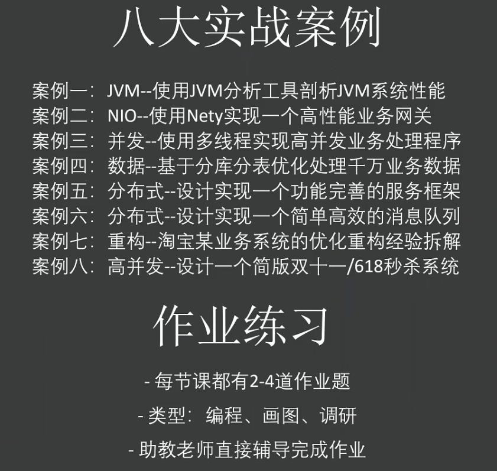
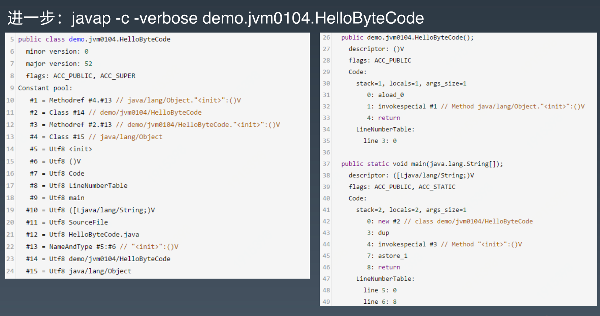

# Week_01

## 10.11 Java 进阶训练营第 0 期开营第一课

1. Redis 用来**读**，MQ用来**写**。
2. 
3. 手撕微服务框架。

## 10.15 JVM核心技术

### 学习目标

昨天晚上1-2点跟不少同学私下沟通了一下，看到不少同学搞清楚了字节码大概的原理和流程，了解了Classloader的用法和jvm的内存结构，挺好的，这就够了，达到目标了。

1. 第一节课不讲字节码的所有内容，因为没必要，200个操作码，每一个讲一下，找个例子，一整天啥也不干就讲不完。就像是本新华字典，没人会真的把几万个汉字都学一遍。怎么怎么回事儿，用的时候能去查，就够了。字节码的原理搞明白了，才知道为什么jvm叫java虚拟机。线程堆栈操作搞明白大概什么回事儿了，后面的内存和多线程操作，是怎么回事儿，都是铺垫的基础。字节码面试一般被问的不算多，工作中应用的偏底层框架和中间件。对个人来讲，理解java代码写法不同，特别是语法糖的部分，非常有帮助，比如for i++和for each到底是不是一样的，看字节码就成了。同样功能的代码，哪个效率更高，看看字节码复杂程度就有个简单判断。等等。
2. ==classloader模块是个重点==，有很多用处，比如跑程序的时候，发现一个类找不到/或者类找到了方法参数类型不匹配，怎么办，可以用课上那个打印各个类加载器加载的jar，看看是不是少加载了，或者加载错了版本。
3. ==内存模型==，这一块是后面gc的基础，也是重点。先不用考虑gc的细节，明天晚上讲，了解了内存里有哪些组成部分，都是做什么的，就可以了。工作中用处也很多，典型的就是xmx要理解透，线上不能瞎配置，系统会崩的。gc作为jvm的重点，就是个内存管理器，这一块实际面试会问的比较多。并发相关问题，第三个模块讲。
4. jvm参数，后面两课还会详细讲，特别是第二次的工具使用操作和gc，常用的参数都能带着大家练手，不用在本节课搞太多细节，知道有哪几类就可以了。

明天讲：

1. 各种命令行工具和图形工具的使用，怎么来查看jvm的运行状态，具体分析主要放到第三次课讲。
2. 常用的gc算法大概怎么回事儿，有什么特点，什么情况下应该使用什么gc这些问题。

### Java字节码技术

- 

  事先已经知道栈的深度、局部变量区大小（右图）

- 字节码中 byte boleaon都用int表示

- 32位机器处理long（64位）会分两次操作，当前一次操作出错后，后面会中断，因此不是原子操作。而64位就是一次操作为原子操作。

- 类型转换在编译时候执行：i2l

- 虚方法 实方法 子类覆盖父类 使用虚方法

#### 理解字节码诀窍

- 给局部变量赋值时，需要使用相应的指令来进行 `store` ，如 `astore_1` 。 `store` 类的指令都会删除栈顶值。 存储在本地变量表中。
- 相应的 `load` 指令则会将值从局部变量表压入操作数栈，但并不会删除局部变量中的值。

#### `for each` 和 `for i++` 的区别

```java
/**
 * 流程控制指令
 *
 * @Author: Yunkai Bo
 * @Date: 2020/10/17 12:54
 * @Version 1.0
 */
public class ForLoopTest {
    private static int[] numbers = {1, 6, 8};

    public static void main(String[] args) {
        MovingAverage ma = new MovingAverage();
        for (int number : numbers) {
            ma.submit(number);
        }
        double avg = ma.getAvg();
    }
}
```


```java
public static main([Ljava/lang/String;)V
   L0
    LINENUMBER 14 L0
    NEW Week_01/demo/MovingAverage
    DUP
    INVOKESPECIAL Week_01/demo/MovingAverage.<init> ()V
    ASTORE 1
   L1
    LINENUMBER 15 L1
    GETSTATIC Week_01/demo/ForLoopTest.numbers : [I
    ASTORE 2
    ALOAD 2
    ARRAYLENGTH
    ISTORE 3
    ICONST_0
    ISTORE 4
   L2
   FRAME FULL [[Ljava/lang/String; Week_01/demo/MovingAverage [I I I] []
    ILOAD 4
    ILOAD 3
    IF_ICMPGE L3 // 比较部分
    ALOAD 2
    ILOAD 4
    IALOAD
    ISTORE 5
   L4
    LINENUMBER 16 L4
    ALOAD 1
    ILOAD 5
    I2D
    INVOKEVIRTUAL Week_01/demo/MovingAverage.submit (D)V
   L5
    LINENUMBER 15 L5
    IINC 4 1
    GOTO L2
   L3
    LINENUMBER 18 L3
   FRAME CHOP 3
    ALOAD 1
    INVOKEVIRTUAL Week_01/demo/MovingAverage.getAvg ()D
    DSTORE 2
   L6
    LINENUMBER 19 L6
    RETURN
   L7
    LOCALVARIABLE number I L4 L5 5
    LOCALVARIABLE args [Ljava/lang/String; L0 L7 0
    LOCALVARIABLE ma LWeek_01/demo/MovingAverage; L1 L7 1
    LOCALVARIABLE avg D L6 L7 2
    MAXSTACK = 3
    MAXLOCALS = 6
```


```java
/**
 * 流程控制指令
 *
 * @Author: Yunkai Bo
 * @Date: 2020/10/17 12:54
 * @Version 1.0
 */
public class ForLoopTest {
    private static int[] numbers = {1, 6, 8};

    public static void main(String[] args) {
        MovingAverage ma = new MovingAverage();
        for (int i = 0; i < numbers.length; i++) {
            ma.submit(numbers[i]);
        }
        double avg = ma.getAvg();
    }
}
```


```java
public static main([Ljava/lang/String;)V
   L0
    LINENUMBER 14 L0
    NEW Week_01/demo/MovingAverage
    DUP
    INVOKESPECIAL Week_01/demo/MovingAverage.<init> ()V
    ASTORE 1
   L1
    LINENUMBER 15 L1
    ICONST_0
    ISTORE 2
   L2
   FRAME APPEND [Week_01/demo/MovingAverage I]
    ILOAD 2
    GETSTATIC Week_01/demo/ForLoopTest.numbers : [I
    ARRAYLENGTH
    IF_ICMPGE L3
   L4
    LINENUMBER 16 L4
    ALOAD 1
    GETSTATIC Week_01/demo/ForLoopTest.numbers : [I
    ILOAD 2
    IALOAD
    I2D
    INVOKEVIRTUAL Week_01/demo/MovingAverage.submit (D)V
   L5
    LINENUMBER 15 L5
    IINC 2 1
    GOTO L2
   L3
    LINENUMBER 18 L3
   FRAME CHOP 1
    ALOAD 1
    INVOKEVIRTUAL Week_01/demo/MovingAverage.getAvg ()D
    DSTORE 2
   L6
    LINENUMBER 19 L6
    RETURN
   L7
    LOCALVARIABLE i I L2 L3 2
    LOCALVARIABLE args [Ljava/lang/String; L0 L7 0
    LOCALVARIABLE ma LWeek_01/demo/MovingAverage; L1 L7 1
    LOCALVARIABLE avg D L6 L7 2
    MAXSTACK = 3
    MAXLOCALS = 4
```

### Java类加载器

==类加载机制有三个特点：==

1. **双亲委托**：当一个自定义类加载器需要加载一个类，比如java.lang.String，它很懒，不会一上来就直接试图加载它，而是先委托自己的父加载器去加载，父加载器如果发现自己还有父加载器，会一直往前找，这样只要上级加载器，比如启动类加载器已经加载了某个类比如java.lang.String，所有的子加载器都不需要自己加载了。如果几个类加载器都没有加载到指定名称的类，那么会抛出  ClassNotFountException异常。
2. **负责依赖**：如果一个加载器在加载某个类的时候，发现这个类依赖于另外几个类或接口，也会去尝试加载这些依赖项。
3. **缓存加载**：为了提升加载效率，消除重复加载，一旦某个类被一个类加载器加载，那么它会缓存这个加载结果，不会重复加载。同一个类只会加载一次

### Java内存模型（JMM）

方法中使用的原生数据类型和对象引用地址在栈上存储；对象、对象成员与类定义、静态变量在堆上。

## 10.17 工具与 GC 策略

###  JDK 内置命令行工具

`jmap -heap PID`

当默认配置 `java -jar xxx.jar` 时，显示堆栈信息如下：

```powershell
using thread-local object allocation.
Parallel GC with 10 thread(s)

Heap Configuration:
   MinHeapFreeRatio         = 0
   MaxHeapFreeRatio         = 100
   MaxHeapSize              = 4255121408 (4058.0MB) // 最大堆容量，默认是物理内存容量(16GB)的 1 / 4 
   NewSize                  = 88604672 (84.5MB)     // 初始化新生代容量，默认是物理容量(8GB)的 1 / 64
   MaxNewSize               = 1418199040 (1352.5MB) // 最大新生代容量，恰好是堆最大容量(2GB)的 1 / 3
   OldSize                  = 177733632 (169.5MB)
   NewRatio                 = 2 // 老年代 : 新生代 = 2 : 1
   SurvivorRatio            = 8 // Eden : survivor = 8 : 1 : 1
   MetaspaceSize            = 21807104 (20.796875MB)
   CompressedClassSpaceSize = 1073741824 (1024.0MB)
   MaxMetaspaceSize         = 17592186044415 MB
   G1HeapRegionSize         = 0 (0.0MB)
   
Heap Usage:
PS Young Generation
Eden Space:
   capacity = 461373440 (440.0MB)
   used     = 410179808 (391.1779479980469MB)
   free     = 51193632 (48.822052001953125MB)
   88.9040790904652% used
From Space:
   capacity = 13631488 (13.0MB)
   used     = 10794288 (10.294235229492188MB)
   free     = 2837200 (2.7057647705078125MB)
   79.18642484224759% used
To Space:
   capacity = 14155776 (13.5MB)
   used     = 0 (0.0MB)
   free     = 14155776 (13.5MB)
   0.0% used
PS Old Generation
   capacity = 256901120 (245.0MB)
   used     = 35745240 (34.089317321777344MB)
   free     = 221155880 (210.91068267822266MB)
   13.914007070113202% used
```

当**CMS GC**配置 `java -jar -XX:+UseConcMarkSweepGC xxx.jar` 时，显示堆栈信息如下：

```powershell
using parallel threads in the new generation.
using thread-local object allocation.
Concurrent Mark-Sweep GC

Heap Configuration:
   MinHeapFreeRatio         = 40
   MaxHeapFreeRatio         = 70
   MaxHeapSize              = 4255121408 (4058.0MB)
   NewSize                  = 88735744 (84.625MB)
   MaxNewSize               = 872415232 (832.0MB) // 64*6*13/6(64位机器*6核*系数)
   OldSize                  = 177602560 (169.375MB)
   NewRatio                 = 2
   SurvivorRatio            = 8
   MetaspaceSize            = 21807104 (20.796875MB)
   CompressedClassSpaceSize = 1073741824 (1024.0MB)
   MaxMetaspaceSize         = 17592186044415 MB
   G1HeapRegionSize         = 0 (0.0MB)
   
Heap Usage:
New Generation (Eden + 1 Survivor Space):
   capacity = 79888384 (76.1875MB)
   used     = 42802488 (40.81963348388672MB)
   free     = 37085896 (35.36786651611328MB)
   53.577861832829164% used
Eden Space:
   capacity = 71041024 (67.75MB)
   used     = 37022608 (35.30751037597656MB)
   free     = 34018416 (32.44248962402344MB)
   52.114406459006% used
From Space:
   capacity = 8847360 (8.4375MB)
   used     = 5779880 (5.512123107910156MB)
   free     = 3067480 (2.9253768920898438MB)
   65.32886646412037% used
To Space:
   capacity = 8847360 (8.4375MB)
   used     = 0 (0.0MB)
   free     = 8847360 (8.4375MB)
   0.0% used
concurrent mark-sweep generation:
   capacity = 177602560 (169.375MB)
   used     = 42803664 (40.82075500488281MB)
   free     = 134798896 (128.5542449951172MB)
   24.100814763030442% used
```

当**G1 GC**配置 `java -jar -XX:+UseG1GC xxx.jar` 时，显示堆栈信息如下：

```powershell
using thread-local object allocation.
Garbage-First (G1) GC with 10 thread(s)

Heap Configuration:
   MinHeapFreeRatio         = 40
   MaxHeapFreeRatio         = 70
   MaxHeapSize              = 4255121408 (4058.0MB)
   NewSize                  = 1363144 (1.2999954223632812MB)
   MaxNewSize               = 2552233984 (2434.0MB)
   OldSize                  = 5452592 (5.1999969482421875MB)
   NewRatio                 = 2
   SurvivorRatio            = 8
   MetaspaceSize            = 21807104 (20.796875MB)
   CompressedClassSpaceSize = 1073741824 (1024.0MB)
   MaxMetaspaceSize         = 17592186044415 MB
   G1HeapRegionSize         = 1048576 (1.0MB)

Heap Usage:
G1 Heap:
   regions  = 4058
   capacity = 4255121408 (4058.0MB)
   used     = 142572528 (135.96775817871094MB)
   free     = 4112548880 (3922.032241821289MB)
   3.350610107903177% used
G1 Young Generation:
Eden Space:
   regions  = 93
   capacity = 152043520 (145.0MB)
   used     = 97517568 (93.0MB)
   free     = 54525952 (52.0MB)
   64.13793103448276% used
Survivor Space:
   regions  = 15
   capacity = 15728640 (15.0MB)
   used     = 15728640 (15.0MB)
   free     = 0 (0.0MB)
   100.0% used
G1 Old Generation:
   regions  = 28
   capacity = 98566144 (94.0MB)
   used     = 29326320 (27.967758178710938MB)
   free     = 69239824 (66.03224182128906MB)
   29.752934232671212% used
```

### 垃圾回收器

- ==JDK 1.8 及之前为**并行GC**，JDK9 之后为 **G1**。==
- CMS GC 为**并发 GC**，即在垃圾回收的过程中，业务代码也会并发运行，不会 STW。而**并行 GC** 则是会 STW。
- CMS GC 的  `MaxNewSize` 为 $64(64位机器)*4(并行线程数)*c(系数)$ 。
- **并行垃圾收集器**适用于多核服务器，主要目标是增加吞吐量。**CMS GC** 的设计目标是避免在老年代垃圾收集时出现长时间的卡顿。**G1 GC**最主要的设计目标是：将STW停顿的时间和分布，变成可预期且可配置的。每次只处理一部分内存块。

### 调试参数

|                  参数                  |                   作用                   |
| :------------------------------------: | :--------------------------------------: |
|               -Xms4096m                |                初始堆大小                |
|               -Xmx4096m                |                最大堆大小                |
|               -Xmn1536m                |       新生代大小 eden + from + to        |
|                -Xss512K                |                 线程大小                 |
|             -XX:NewRatio=2             |           新生代和老年代的比例           |
|          -XX:MaxPermSize=64m           |               持久代最大值               |
|            -XX:PermSize=16m            |               持久代初始值               |
|          -XX:SurvivorRatio=8           |        eden 区和survivor区的比例         |
|     -verbose:gc \| -Xloggc:gc.log      |              输出gc日志文件              |
|       -XX:+UseGCLogFileRotation        |           使用log文件循环输出            |
|        -XX:NumberOfGCLogFiles=1        |             循环输出文件数量             |
|          -XX:GCLogFileSize=8k          |             日志文件大小限制             |
|         -XX:+PrintGCDateStamps         |              gc日志打印时间              |
|     -XX:+PrintTenuringDistribution     |   查看每次minor GC后新的存活周期的阈值   |
|          -XX:+PrintGCDetails           |                输出gc明细                |
|   -XX:+PrintGCApplicationStoppedTime   |         输出gc造成应用停顿的时间         |
|         -XX:+PrintReferenceGC          |         输出堆内对象引用收集时间         |
|           -XX:+PrintHeapAtGC           |           输出gc前后堆占用情况           |
|           -XX:+UseParallelGC           |         年轻代并行GC，标记-清除          |
|         -XX:+UseParallelOldGC          |         老年代并行GC，标记-清除          |
|        -XX:ParallelGCThreads=23        |   并行GC线程数， cpu<=8?cpu:5*cpu/8+3    |
|       -XX:+UseAdaptiveSizePolicy       |  默认，自动调整年轻代各区大小及晋升年龄  |
|        -XX:MaxGCPauseMillis=15         |      每次GC最大停顿时间，单位为毫秒      |
|            -XX:+UseParNewGC            |              Serial多线程版              |
|        -XX:+UseConcMarkSweepGC         |                CMS old gc                |
|   -XX:+UseCMSCompactAtFullCollection   |       FullGC后进行内存碎片整理压缩       |
|    -XX:CMSFullGCsBeforeCompaction=n    |         n次FullGC后执行内存整理          |
|     -XX:+CMSParallelRemarkEnabled      |     启用并行重新标记，只适用ParNewGC     |
| -XX:CMSInitiatingOccupancyFraction=80  |      cms作为垃圾回收是，回收比例80%      |
|        -XX:ParallelGCThreads=23        |    并行GC线程数，cpu<=8?cpu:5*cpu/8+3    |
|            -XX:-UseSerialGC            |       默认不启用，client使用时启用       |
|              -XX:+UseG1GC              |               启用G1收集器               |
|       -XX:-UseAdaptiveSizePolicy       |    默认，不自动调整各区大小及晋升年龄    |
|   -XX:PretenureSizeThreshold=2097152   |        直接晋升到老年代的对象大小        |
|  -XX:MaxTenuringThreshold=15(default)  |    晋升到老年代的对象年龄，PSGen无效     |
|         -XX:-DisableExplicitGC         |    禁止在运行期显式地调用?System.gc()    |
|    -XX:+HeapDumpOnOutOfMemoryError     |          在OOM时输出堆内存快照           |
| -XX:HeapDumpPath=./java_pid<pid>.hprof |           堆内存快照的存储路径           |
|      -XX:+CMSScavengeBeforeRemark      | 执行CMS重新标记之前，尝试执行一此MinorGC |
|     -XX:+CMSPermGenSweepingEnabled     |         开启永久代的并发垃圾收集         |

