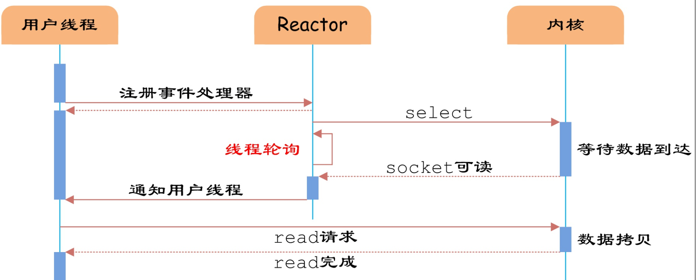
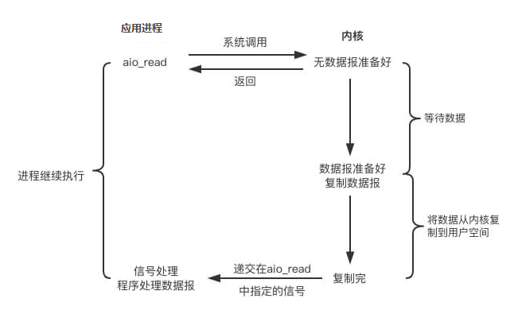

# Week_01

## 10.22 调优分析与面试经验

### GC 日志解读与分析

- `‐XX:ParallelGCThreads=n`

设置STW阶段的并行 worker 线程数量。 

如果逻辑处理器**小于等于8**个，则默认值 **n** 等于逻辑处理器的数量。 

如果逻辑处理器**大于8**个，则默认值 n 等于处理器数量的 **5/8+3** 。 在大多数情况下都是个比较合理的值。 如果是高配置的 SPARC 系统，则默认值 n  大约等于逻辑处理器数量的 5/16 。

> [Garbage First Garbage Collector Tuning](https://www.oracle.com/technical-resources/articles/java/g1gc.html)

### 关于一点 G1 与 CMS 的思考

既然有了 G1 为什么还要使用 CMS 呢？

> G1相对于CMS仍然不是占全方位、压倒性优势的，从它出现几年仍不能在所有应用场景中代替CMS就可以得知这个结论。比起CMS，G1的弱项也可以列举出不少，如在用户程序运行过程中，G1无论是为了垃圾收集产生的内存占用（Footprint）还是程序运行时的额外执行负载（Overload）都要比CMS要高。
>
> ...
>
> 按照笔者的实践经验，目前在小内存应用上CMS的表现大概率仍然要会优于G1，而在大内存应用上G1则大多能发挥其优势，这个优劣势的Java堆容量平衡点通常在6GB至8GB之间
>
> ——周志明「深入理解 Java 虚拟机」

### 关于测试代码 GCLogAnalysis

代码示例

```java
package Week_02.demo;

import java.util.Random;
import java.util.concurrent.TimeUnit;
import java.util.concurrent.atomic.LongAdder;

/**
 * @Author: Yunkai Bo
 * @Date: 2020/10/28 10:58
 * @Version 1.0
 */
public class GCLogAnalysis {
    private static Random random = new Random();

    public static void main(String[] args) {
        // 当前毫秒时间戳
        long startMillis = System.currentTimeMillis();
        // 持续运行毫秒数; 可根据需要进行修改
        long timeoutMillis = TimeUnit.SECONDS.toMillis(1);
        // 结束时间戳
        long endMillis = startMillis + timeoutMillis;
        LongAdder counter = new LongAdder();
        System.out.println("正在执行...");
        // 缓存一部分对象; 进入老年代
        int cacheSize = 2000;
        Object[] cachedGarbage = new Object[cacheSize];
        // 在此时间范围内,持续循环
        while (System.currentTimeMillis() < endMillis) {
            // 生成垃圾对象
            Object garbage = generateGarbage(100 * 1024);
            counter.increment();
            int randomIndex = random.nextInt(2 * cacheSize);
            if (randomIndex < cacheSize) {
                cachedGarbage[randomIndex] = garbage;
            }
        }
        System.out.println("执行结束!共生成对象次数:" + counter.longValue());
    }

    // 生成对象
    private static Object generateGarbage(int max) {
        int randomSize = random.nextInt(max);
        int type = randomSize % 4;
        Object result = null;
        switch (type) {
            case 0:
                result = new int[randomSize];
                break;
            case 1:
                result = new byte[randomSize];
                break;
            case 2:
                result = new double[randomSize];
                break;
            default:
                StringBuilder builder = new StringBuilder();
                String randomString = "randomString‐Anything";
                while (builder.length() < randomSize) {
                    builder.append(randomString);
                    builder.append(max);
                    builder.append(randomSize);
                }
                result = builder.toString();
                break;
        }
        return result;
    }
}
```

用途：

- 比如让缓存的对象变多，在限制堆内存的情况下，就可以模拟**内存溢出**。同时在增加内存的情况下可以看到其生成对象数量的增加，同时也会降低OOM的概率，减少 GC 次数。可以直观感受其性能的提升。
- 增加运行时长，比如加到30分钟或者更长，我们就可以用前面介绍过的 **VisualVM** 等工具来实时监控和观察。
- 当然，我们也可以使用全局静态变量来缓存，用来模拟**内存泄漏**，以及进行堆内存Dump的试验和分析。
- 加大每次生成的数组的大小，可以用来模拟**大对象/巨无霸**对象（大对象/巨无霸对象主要是G1中的概念，比如超过1MB的数组）。

### 压测工具 SuperBenchmarker

#### 安装

在 Windows 系统安装如下：

1. 安装**chocolatey**，一个类似 apt-get 的工具，用管理员身份运行如下代码：

   ```powershell
   Set-ExecutionPolicy Bypass -Scope Process -Force; [System.Net.ServicePointManager]::SecurityProtocol = [System.Net.ServicePointManager]::SecurityProtocol -bor 3072; iex ((New-Object System.Net.WebClient).DownloadString('https://chocolatey.org/install.ps1'))
   ```

2. 安装 **SuperBenchmarker**，运行如下代码：

   ```powershell
   cinst SuperBenchmarker
   ```

#### 操作命令如下

```powershell
sb -u URL -c 线程数 -N 时间
```

## 10.24 NIO 模型与 Netty 入门

### select/poll 的几大缺点：

1. 每次调用 select，都需要把 fd 集合从用户态拷贝到内核态，这个开销在 fd 很多时会很大。
2. 同时每次调用 select 都需要在内核遍历传递进来的所有 fd，这个开销在 fd 很多时也很大。（数据结构为链表）
3. select 支持的文件描述符数量太小了，默认是1024。

### epoll：

1. 内核与用户空间共享一块内存
2. 通过回调解决遍历问题（红黑树）
3. fd 没有限制，可以支撑10万连接



### Reactor

IO 多路复用(IO multiplexing)，也称事件驱动 IO(event-driven IO)，就是在**单个线程**里同时监控多个套接字，通过select 或 poll 轮询所负责的所有socket，当某个 socket 有数据到达了，就通知用户进程。

### Proactor

用户进程发出系统调用后立即返回，内核等待数据准备完成，然后将数据拷贝到用户进程缓冲区，然后发
送信号告诉用户进程 **IO 操作执行完毕**（与 SIGIO 相比，一个是发送信号告诉用户进程数据准备完毕，一个是 IO执行完毕）。

