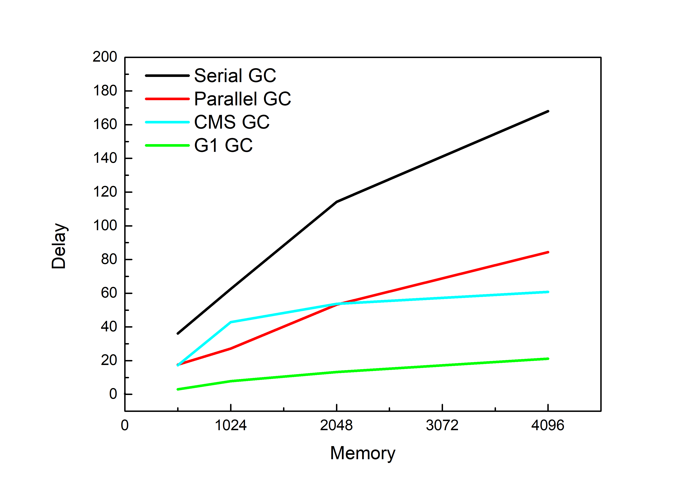
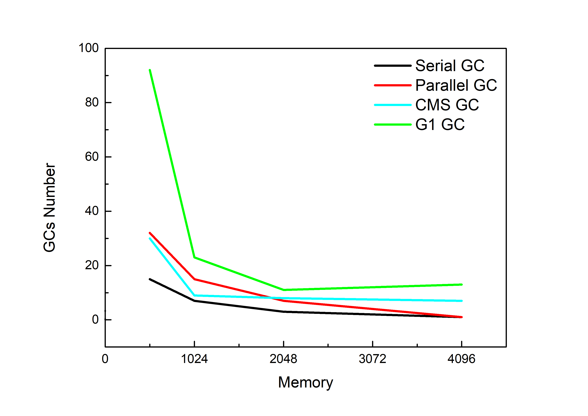

# 不同 GC 的总结

## Serial GC

操作命令

```powershell
PS D:\JAVA-000\src> java -Xms512m -Xmx512m -XX:+PrintGCDetails -XX:+PrintGCDateStamps -XX:+UseSerialGC -Xloggc:Week_02/gc_log/serial_default.log Week_02.demo.GCLogAnalysis
正在执行...
执行结束!共生成对象次数:12334
```

输出日志文件：

```powershell
Java HotSpot(TM) 64-Bit Server VM (25.261-b12) for windows-amd64 JRE (1.8.0_261-b12), built on Jun 18 2020 06:56:32 by "" with unknown MS VC++:1916
Memory: 4k page, physical 16616892k(6938088k free), swap 19107260k(4623288k free)
CommandLine flags: -XX:InitialHeapSize=536870912 -XX:MaxHeapSize=536870912 -XX:+PrintGC -XX:+PrintGCDateStamps -XX:+PrintGCDetails -XX:+PrintGCTimeStamps -XX:+UseCompressedClassPointers -XX:+UseCompressedOops -XX:-UseLargePagesIndividualAllocation -XX:+UseSerialGC 
2020-10-28T20:02:32.225+0800: 0.143: [GC (Allocation Failure) 2020-10-28T20:02:32.225+0800: 0.143: [DefNew: 139776K->17471K(157248K), 0.0205491 secs] 139776K->48068K(506816K), 0.0206694 secs] [Times: user=0.00 sys=0.03, real=0.02 secs] 
2020-10-28T20:02:32.261+0800: 0.179: [GC (Allocation Failure) 2020-10-28T20:02:32.261+0800: 0.179: [DefNew: 157247K->17471K(157248K), 0.0257290 secs] 187844K->91221K(506816K), 0.0257851 secs] [Times: user=0.00 sys=0.01, real=0.03 secs] 
2020-10-28T20:02:32.301+0800: 0.218: [GC (Allocation Failure) 2020-10-28T20:02:32.301+0800: 0.218: [DefNew: 157144K->17471K(157248K), 0.0213518 secs] 230894K->138616K(506816K), 0.0214124 secs] [Times: user=0.02 sys=0.00, real=0.02 secs] 
2020-10-28T20:02:32.336+0800: 0.254: [GC (Allocation Failure) 2020-10-28T20:02:32.336+0800: 0.254: [DefNew: 157157K->17471K(157248K), 0.0208124 secs] 278303K->184700K(506816K), 0.0208676 secs] [Times: user=0.01 sys=0.02, real=0.02 secs] 
2020-10-28T20:02:32.372+0800: 0.289: [GC (Allocation Failure) 2020-10-28T20:02:32.372+0800: 0.289: [DefNew: 157247K->17468K(157248K), 0.0178278 secs] 324476K->224226K(506816K), 0.0178834 secs] [Times: user=0.01 sys=0.00, real=0.02 secs] 
2020-10-28T20:02:32.405+0800: 0.322: [GC (Allocation Failure) 2020-10-28T20:02:32.405+0800: 0.322: [DefNew: 157244K->17470K(157248K), 0.0176561 secs] 364002K->263147K(506816K), 0.0177234 secs] [Times: user=0.02 sys=0.00, real=0.02 secs] 
2020-10-28T20:02:32.436+0800: 0.354: [GC (Allocation Failure) 2020-10-28T20:02:32.436+0800: 0.354: [DefNew: 157246K->17471K(157248K), 0.0196373 secs] 402923K->306168K(506816K), 0.0196935 secs] [Times: user=0.02 sys=0.00, real=0.02 secs] 
2020-10-28T20:02:32.469+0800: 0.387: [GC (Allocation Failure) 2020-10-28T20:02:32.469+0800: 0.387: [DefNew: 156868K->17470K(157248K), 0.0226006 secs] 445565K->356443K(506816K), 0.0226605 secs] [Times: user=0.00 sys=0.01, real=0.02 secs] 
2020-10-28T20:02:32.505+0800: 0.423: [GC (Allocation Failure) 2020-10-28T20:02:32.505+0800: 0.423: [DefNew: 157246K->157246K(157248K), 0.0000131 secs]2020-10-28T20:02:32.505+0800: 0.423: [Tenured: 338973K->272717K(349568K), 0.0300585 secs] 496219K->272717K(506816K), [Metaspace: 2722K->2722K(1056768K)], 0.0301398 secs] [Times: user=0.03 sys=0.00, real=0.03 secs] 
2020-10-28T20:02:32.549+0800: 0.467: [GC (Allocation Failure) 2020-10-28T20:02:32.549+0800: 0.467: [DefNew: 139776K->17471K(157248K), 0.0056482 secs] 412493K->322038K(506816K), 0.0057103 secs] [Times: user=0.00 sys=0.00, real=0.01 secs] 
2020-10-28T20:02:32.569+0800: 0.487: [GC (Allocation Failure) 2020-10-28T20:02:32.569+0800: 0.487: [DefNew: 157247K->157247K(157248K), 0.0000130 secs]2020-10-28T20:02:32.569+0800: 0.487: [Tenured: 304566K->307182K(349568K), 0.0330481 secs] 461814K->307182K(506816K), [Metaspace: 2722K->2722K(1056768K)], 0.0331309 secs] [Times: user=0.03 sys=0.00, real=0.03 secs] 
2020-10-28T20:02:32.616+0800: 0.534: [GC (Allocation Failure) 2020-10-28T20:02:32.616+0800: 0.534: [DefNew: 139776K->139776K(157248K), 0.0000125 secs]2020-10-28T20:02:32.616+0800: 0.534: [Tenured: 307182K->321542K(349568K), 0.0339184 secs] 446958K->321542K(506816K), [Metaspace: 2722K->2722K(1056768K)], 0.0339978 secs] [Times: user=0.03 sys=0.00, real=0.03 secs] 
2020-10-28T20:02:32.663+0800: 0.581: [GC (Allocation Failure) 2020-10-28T20:02:32.663+0800: 0.581: [DefNew: 139776K->139776K(157248K), 0.0000129 secs]2020-10-28T20:02:32.663+0800: 0.581: [Tenured: 321542K->315252K(349568K), 0.0365619 secs] 461318K->315252K(506816K), [Metaspace: 2722K->2722K(1056768K)], 0.0366486 secs] [Times: user=0.05 sys=0.00, real=0.04 secs] 
2020-10-28T20:02:32.715+0800: 0.632: [GC (Allocation Failure) 2020-10-28T20:02:32.715+0800: 0.632: [DefNew: 139776K->139776K(157248K), 0.0000138 secs]2020-10-28T20:02:32.715+0800: 0.632: [Tenured: 315252K->342955K(349568K), 0.0229064 secs] 455028K->342955K(506816K), [Metaspace: 2722K->2722K(1056768K)], 0.0229863 secs] [Times: user=0.02 sys=0.00, real=0.02 secs] 
2020-10-28T20:02:32.751+0800: 0.669: [GC (Allocation Failure) 2020-10-28T20:02:32.751+0800: 0.669: [DefNew: 139776K->139776K(157248K), 0.0000133 secs]2020-10-28T20:02:32.751+0800: 0.669: [Tenured: 342955K->349331K(349568K), 0.0326744 secs] 482731K->350022K(506816K), [Metaspace: 2722K->2722K(1056768K)], 0.0327519 secs] [Times: user=0.03 sys=0.00, real=0.03 secs] 
2020-10-28T20:02:32.799+0800: 0.716: [Full GC (Allocation Failure) 2020-10-28T20:02:32.799+0800: 0.716: [Tenured: 349457K->349505K(349568K), 0.0357326 secs] 506689K->355650K(506816K), [Metaspace: 2722K->2722K(1056768K)], 0.0357951 secs] [Times: user=0.03 sys=0.00, real=0.04 secs] 
2020-10-28T20:02:32.850+0800: 0.768: [Full GC (Allocation Failure) 2020-10-28T20:02:32.851+0800: 0.768: [Tenured: 349540K->346754K(349568K), 0.0401689 secs] 506786K->346754K(506816K), [Metaspace: 2722K->2722K(1056768K)], 0.0402389 secs] [Times: user=0.05 sys=0.00, real=0.04 secs] 
2020-10-28T20:02:32.903+0800: 0.821: [GC (Allocation Failure) 2020-10-28T20:02:32.903+0800: 0.821: [DefNew: 139776K->139776K(157248K), 0.0000125 secs]2020-10-28T20:02:32.903+0800: 0.821: [Tenured: 346754K->349123K(349568K), 0.0254352 secs] 486530K->371201K(506816K), [Metaspace: 2722K->2722K(1056768K)], 0.0255142 secs] [Times: user=0.02 sys=0.00, real=0.02 secs] 
2020-10-28T20:02:32.942+0800: 0.860: [Full GC (Allocation Failure) 2020-10-28T20:02:32.942+0800: 0.860: [Tenured: 349232K->349518K(349568K), 0.0334980 secs] 506459K->373829K(506816K), [Metaspace: 2722K->2722K(1056768K)], 0.0335624 secs] [Times: user=0.03 sys=0.00, real=0.03 secs] 
2020-10-28T20:02:32.988+0800: 0.906: [Full GC (Allocation Failure) 2020-10-28T20:02:32.988+0800: 0.906: [Tenured: 349518K->349198K(349568K), 0.0361813 secs] 506121K->372204K(506816K), [Metaspace: 2722K->2722K(1056768K)], 0.0362449 secs] [Times: user=0.03 sys=0.00, real=0.04 secs] 
2020-10-28T20:02:33.037+0800: 0.955: [Full GC (Allocation Failure) 2020-10-28T20:02:33.038+0800: 0.955: [Tenured: 349198K->349290K(349568K), 0.0417374 secs] 505832K->357626K(506816K), [Metaspace: 2722K->2722K(1056768K)], 0.0418010 secs] [Times: user=0.05 sys=0.00, real=0.04 secs] 
2020-10-28T20:02:33.094+0800: 1.012: [Full GC (Allocation Failure) 2020-10-28T20:02:33.094+0800: 1.012: [Tenured: 349290K->349207K(349568K), 0.0317006 secs] 506472K->370911K(506816K), [Metaspace: 2722K->2722K(1056768K)], 0.0317619 secs] [Times: user=0.03 sys=0.00, real=0.03 secs] 
2020-10-28T20:02:33.139+0800: 1.057: [Full GC (Allocation Failure) 2020-10-28T20:02:33.139+0800: 1.057: [Tenured: 349392K->349459K(349568K), 0.0352959 secs] 506509K->373374K(506816K), [Metaspace: 2722K->2722K(1056768K)], 0.0353554 secs] [Times: user=0.03 sys=0.00, real=0.04 secs] 
Heap
 def new generation   total 157248K, used 30048K [0x00000000e0000000, 0x00000000eaaa0000, 0x00000000eaaa0000)
  eden space 139776K,  21% used [0x00000000e0000000, 0x00000000e1d58090, 0x00000000e8880000)
  from space 17472K,   0% used [0x00000000e9990000, 0x00000000e9990000, 0x00000000eaaa0000)
  to   space 17472K,   0% used [0x00000000e8880000, 0x00000000e8880000, 0x00000000e9990000)
 tenured generation   total 349568K, used 349459K [0x00000000eaaa0000, 0x0000000100000000, 0x0000000100000000)
   the space 349568K,  99% used [0x00000000eaaa0000, 0x00000000fffe4e80, 0x00000000fffe5000, 0x0000000100000000)
 Metaspace       used 2729K, capacity 4486K, committed 4864K, reserved 1056768K
  class space    used 291K, capacity 386K, committed 512K, reserved 1048576K
```

## Parallel GC

操作命令

```powershell
PS D:\JAVA-000\src> java -Xms512m -Xmx512m -XX:+PrintGCDetails -XX:+PrintGCDateStamps -XX:+UseParallelGC -Xloggc:Week_02/gc_log/parallel_default.log Week_02.demo.GCLogAnalysis
正在执行...
执行结束!共生成对象次数:9411
```

输出日志文件：

```powershell
Java HotSpot(TM) 64-Bit Server VM (25.261-b12) for windows-amd64 JRE (1.8.0_261-b12), built on Jun 18 2020 06:56:32 by "" with unknown MS VC++:1916
Memory: 4k page, physical 16616892k(7718320k free), swap 19107260k(4369772k free)
CommandLine flags: -XX:InitialHeapSize=536870912 -XX:MaxHeapSize=536870912 -XX:+PrintGC -XX:+PrintGCDateStamps -XX:+PrintGCDetails -XX:+PrintGCTimeStamps -XX:+UseCompressedClassPointers -XX:+UseCompressedOops -XX:-UseLargePagesIndividualAllocation -XX:+UseParallelGC 
2020-10-28T20:29:15.566+0800: 0.143: [GC (Allocation Failure) [PSYoungGen: 131584K->21492K(153088K)] 131584K->48227K(502784K), 0.0117956 secs] [Times: user=0.03 sys=0.13, real=0.01 secs] 
2020-10-28T20:29:15.598+0800: 0.174: [GC (Allocation Failure) [PSYoungGen: 153076K->21493K(153088K)] 179811K->93160K(502784K), 0.0144004 secs] [Times: user=0.03 sys=0.13, real=0.01 secs] 
2020-10-28T20:29:15.627+0800: 0.203: [GC (Allocation Failure) [PSYoungGen: 153075K->21489K(153088K)] 224742K->138874K(502784K), 0.0110871 secs] [Times: user=0.03 sys=0.13, real=0.01 secs] 
2020-10-28T20:29:15.654+0800: 0.230: [GC (Allocation Failure) [PSYoungGen: 153073K->21498K(153088K)] 270458K->180072K(502784K), 0.0092686 secs] [Times: user=0.00 sys=0.00, real=0.01 secs] 
2020-10-28T20:29:15.679+0800: 0.255: [GC (Allocation Failure) [PSYoungGen: 153082K->21487K(153088K)] 311656K->218023K(502784K), 0.0087227 secs] [Times: user=0.05 sys=0.11, real=0.01 secs] 
2020-10-28T20:29:15.703+0800: 0.279: [GC (Allocation Failure) [PSYoungGen: 152970K->21486K(80384K)] 349506K->262802K(430080K), 0.0145265 secs] [Times: user=0.01 sys=0.13, real=0.01 secs] 
2020-10-28T20:29:15.727+0800: 0.303: [GC (Allocation Failure) [PSYoungGen: 80366K->32177K(116736K)] 321682K->278902K(466432K), 0.0042948 secs] [Times: user=0.11 sys=0.05, real=0.00 secs] 
2020-10-28T20:29:15.738+0800: 0.314: [GC (Allocation Failure) [PSYoungGen: 90880K->47619K(116736K)] 337605K->300886K(466432K), 0.0061463 secs] [Times: user=0.00 sys=0.00, real=0.01 secs] 
2020-10-28T20:29:15.751+0800: 0.327: [GC (Allocation Failure) [PSYoungGen: 106499K->57850K(116736K)] 359766K->325677K(466432K), 0.0083705 secs] [Times: user=0.00 sys=0.00, real=0.01 secs] 
2020-10-28T20:29:15.766+0800: 0.342: [GC (Allocation Failure) [PSYoungGen: 116730K->42785K(116736K)] 384557K->343261K(466432K), 0.0119544 secs] [Times: user=0.08 sys=0.08, real=0.01 secs] 
2020-10-28T20:29:15.778+0800: 0.354: [Full GC (Ergonomics) [PSYoungGen: 42785K->0K(116736K)] [ParOldGen: 300475K->242924K(349696K)] 343261K->242924K(466432K), [Metaspace: 2722K->2722K(1056768K)], 0.0296776 secs] [Times: user=0.14 sys=0.02, real=0.03 secs] 
2020-10-28T20:29:15.815+0800: 0.391: [GC (Allocation Failure) [PSYoungGen: 58682K->17670K(116736K)] 301606K->260594K(466432K), 0.0020680 secs] [Times: user=0.00 sys=0.00, real=0.00 secs] 
2020-10-28T20:29:15.824+0800: 0.401: [GC (Allocation Failure) [PSYoungGen: 76445K->19824K(116736K)] 319369K->278775K(466432K), 0.0039720 secs] [Times: user=0.00 sys=0.00, real=0.00 secs] 
2020-10-28T20:29:15.836+0800: 0.412: [GC (Allocation Failure) [PSYoungGen: 78651K->21690K(116736K)] 337603K->300152K(466432K), 0.0042870 secs] [Times: user=0.16 sys=0.00, real=0.00 secs] 
2020-10-28T20:29:15.848+0800: 0.424: [GC (Allocation Failure) [PSYoungGen: 80570K->20720K(116736K)] 359032K->319990K(466432K), 0.0043764 secs] [Times: user=0.00 sys=0.00, real=0.00 secs] 
2020-10-28T20:29:15.852+0800: 0.429: [Full GC (Ergonomics) [PSYoungGen: 20720K->0K(116736K)] [ParOldGen: 299270K->262472K(349696K)] 319990K->262472K(466432K), [Metaspace: 2722K->2722K(1056768K)], 0.0268319 secs] [Times: user=0.17 sys=0.00, real=0.03 secs] 
2020-10-28T20:29:15.887+0800: 0.463: [GC (Allocation Failure) [PSYoungGen: 58880K->21514K(116736K)] 321352K->283987K(466432K), 0.0024190 secs] [Times: user=0.00 sys=0.00, real=0.00 secs] 
2020-10-28T20:29:15.896+0800: 0.473: [GC (Allocation Failure) [PSYoungGen: 80394K->16861K(116736K)] 342867K->300453K(466432K), 0.0039406 secs] [Times: user=0.00 sys=0.00, real=0.00 secs] 
2020-10-28T20:29:15.907+0800: 0.483: [GC (Allocation Failure) [PSYoungGen: 75686K->22826K(116736K)] 359278K->321827K(466432K), 0.0042237 secs] [Times: user=0.00 sys=0.00, real=0.00 secs] 
2020-10-28T20:29:15.919+0800: 0.496: [GC (Allocation Failure) [PSYoungGen: 81396K->27941K(116736K)] 380397K->349564K(466432K), 0.0066636 secs] [Times: user=0.00 sys=0.00, real=0.01 secs] 
2020-10-28T20:29:15.926+0800: 0.503: [Full GC (Ergonomics) [PSYoungGen: 27941K->0K(116736K)] [ParOldGen: 321623K->292089K(349696K)] 349564K->292089K(466432K), [Metaspace: 2722K->2722K(1056768K)], 0.0306343 secs] [Times: user=0.30 sys=0.00, real=0.03 secs] 
2020-10-28T20:29:15.963+0800: 0.540: [GC (Allocation Failure) [PSYoungGen: 58309K->19619K(116736K)] 350399K->311709K(466432K), 0.0021510 secs] [Times: user=0.00 sys=0.02, real=0.00 secs] 
2020-10-28T20:29:15.972+0800: 0.548: [GC (Allocation Failure) [PSYoungGen: 78499K->21943K(116736K)] 370589K->332125K(466432K), 0.0042662 secs] [Times: user=0.00 sys=0.00, real=0.00 secs] 
2020-10-28T20:29:15.983+0800: 0.559: [GC (Allocation Failure) [PSYoungGen: 80805K->19427K(116736K)] 390988K->350518K(466432K), 0.0048154 secs] [Times: user=0.00 sys=0.00, real=0.00 secs] 
2020-10-28T20:29:15.987+0800: 0.564: [Full GC (Ergonomics) [PSYoungGen: 19427K->0K(116736K)] [ParOldGen: 331090K->309436K(349696K)] 350518K->309436K(466432K), [Metaspace: 2722K->2722K(1056768K)], 0.0322934 secs] [Times: user=0.30 sys=0.00, real=0.03 secs] 
2020-10-28T20:29:16.027+0800: 0.604: [GC (Allocation Failure) [PSYoungGen: 58880K->21163K(116736K)] 368316K->330600K(466432K), 0.0024533 secs] [Times: user=0.00 sys=0.00, real=0.00 secs] 
2020-10-28T20:29:16.036+0800: 0.612: [GC (Allocation Failure) [PSYoungGen: 79366K->20011K(116736K)] 388802K->349385K(466432K), 0.0041553 secs] [Times: user=0.00 sys=0.00, real=0.00 secs] 
2020-10-28T20:29:16.040+0800: 0.616: [Full GC (Ergonomics) [PSYoungGen: 20011K->0K(116736K)] [ParOldGen: 329373K->311279K(349696K)] 349385K->311279K(466432K), [Metaspace: 2722K->2722K(1056768K)], 0.0309445 secs] [Times: user=0.17 sys=0.00, real=0.03 secs] 
2020-10-28T20:29:16.078+0800: 0.654: [GC (Allocation Failure) [PSYoungGen: 58880K->19923K(116736K)] 370159K->331202K(466432K), 0.0023339 secs] [Times: user=0.00 sys=0.00, real=0.00 secs] 
2020-10-28T20:29:16.087+0800: 0.663: [GC (Allocation Failure) [PSYoungGen: 78085K->19430K(116736K)] 389364K->349550K(466432K), 0.0041471 secs] [Times: user=0.16 sys=0.00, real=0.00 secs] 
2020-10-28T20:29:16.091+0800: 0.667: [Full GC (Ergonomics) [PSYoungGen: 19430K->0K(116736K)] [ParOldGen: 330120K->313314K(349696K)] 349550K->313314K(466432K), [Metaspace: 2722K->2722K(1056768K)], 0.0317161 secs] [Times: user=0.30 sys=0.00, real=0.03 secs] 
2020-10-28T20:29:16.130+0800: 0.706: [GC (Allocation Failure) [PSYoungGen: 58529K->23026K(116736K)] 371844K->336341K(466432K), 0.0026955 secs] [Times: user=0.00 sys=0.00, real=0.00 secs] 
2020-10-28T20:29:16.139+0800: 0.715: [GC (Allocation Failure) [PSYoungGen: 81831K->24122K(116736K)] 395146K->357730K(466432K), 0.0049552 secs] [Times: user=0.00 sys=0.00, real=0.01 secs] 
2020-10-28T20:29:16.144+0800: 0.720: [Full GC (Ergonomics) [PSYoungGen: 24122K->0K(116736K)] [ParOldGen: 333607K->323631K(349696K)] 357730K->323631K(466432K), [Metaspace: 2722K->2722K(1056768K)], 0.0325823 secs] [Times: user=0.28 sys=0.00, real=0.03 secs] 
2020-10-28T20:29:16.183+0800: 0.760: [Full GC (Ergonomics) [PSYoungGen: 58704K->0K(116736K)] [ParOldGen: 323631K->322934K(349696K)] 382336K->322934K(466432K), [Metaspace: 2722K->2722K(1056768K)], 0.0331328 secs] [Times: user=0.31 sys=0.00, real=0.03 secs] 
2020-10-28T20:29:16.224+0800: 0.800: [Full GC (Ergonomics) [PSYoungGen: 58880K->0K(116736K)] [ParOldGen: 322934K->328100K(349696K)] 381814K->328100K(466432K), [Metaspace: 2722K->2722K(1056768K)], 0.0342498 secs] [Times: user=0.31 sys=0.00, real=0.03 secs] 
2020-10-28T20:29:16.266+0800: 0.842: [Full GC (Ergonomics) [PSYoungGen: 58821K->0K(116736K)] [ParOldGen: 328100K->328819K(349696K)] 386921K->328819K(466432K), [Metaspace: 2722K->2722K(1056768K)], 0.0335687 secs] [Times: user=0.30 sys=0.00, real=0.03 secs] 
2020-10-28T20:29:16.306+0800: 0.883: [Full GC (Ergonomics) [PSYoungGen: 58706K->0K(116736K)] [ParOldGen: 328819K->331214K(349696K)] 387526K->331214K(466432K), [Metaspace: 2722K->2722K(1056768K)], 0.0322188 secs] [Times: user=0.31 sys=0.00, real=0.03 secs] 
2020-10-28T20:29:16.346+0800: 0.922: [Full GC (Ergonomics) [PSYoungGen: 58637K->0K(116736K)] [ParOldGen: 331214K->334952K(349696K)] 389851K->334952K(466432K), [Metaspace: 2722K->2722K(1056768K)], 0.0341416 secs] [Times: user=0.31 sys=0.00, real=0.03 secs] 
2020-10-28T20:29:16.386+0800: 0.962: [Full GC (Ergonomics) [PSYoungGen: 58765K->0K(116736K)] [ParOldGen: 334952K->341899K(349696K)] 393718K->341899K(466432K), [Metaspace: 2722K->2722K(1056768K)], 0.0352976 secs] [Times: user=0.31 sys=0.00, real=0.04 secs] 
2020-10-28T20:29:16.431+0800: 1.007: [Full GC (Ergonomics) [PSYoungGen: 58880K->0K(116736K)] [ParOldGen: 341899K->342413K(349696K)] 400779K->342413K(466432K), [Metaspace: 2722K->2722K(1056768K)], 0.0363819 secs] [Times: user=0.30 sys=0.00, real=0.04 secs] 
2020-10-28T20:29:16.475+0800: 1.051: [Full GC (Ergonomics) [PSYoungGen: 58880K->0K(116736K)] [ParOldGen: 342413K->341925K(349696K)] 401293K->341925K(466432K), [Metaspace: 2722K->2722K(1056768K)], 0.0382995 secs] [Times: user=0.44 sys=0.00, real=0.04 secs] 
Heap
 PSYoungGen      total 116736K, used 2372K [0x00000000f5580000, 0x0000000100000000, 0x0000000100000000)
  eden space 58880K, 4% used [0x00000000f5580000,0x00000000f57d1330,0x00000000f8f00000)
  from space 57856K, 0% used [0x00000000f8f00000,0x00000000f8f00000,0x00000000fc780000)
  to   space 57856K, 0% used [0x00000000fc780000,0x00000000fc780000,0x0000000100000000)
 ParOldGen       total 349696K, used 341925K [0x00000000e0000000, 0x00000000f5580000, 0x00000000f5580000)
  object space 349696K, 97% used [0x00000000e0000000,0x00000000f4de9580,0x00000000f5580000)
 Metaspace       used 2729K, capacity 4486K, committed 4864K, reserved 1056768K
  class space    used 291K, capacity 386K, committed 512K, reserved 1048576K
```

## CMS GC

操作命令

```powershell
PS D:\JAVA-000\src> java -Xms512m -Xmx512m -XX:+PrintGCDetails -XX:+PrintGCDateStamps -XX:+UseConcMarkSweepGC -Xloggc:Week_02/gc_log/cms_default.log Week_02.demo.GCLogAnalysis
正在执行...
执行结束!共生成对象次数:12787
```

输出日志文件：

```powershell
Java HotSpot(TM) 64-Bit Server VM (25.261-b12) for windows-amd64 JRE (1.8.0_261-b12), built on Jun 18 2020 06:56:32 by "" with unknown MS VC++:1916
Memory: 4k page, physical 16616892k(7700460k free), swap 19107260k(4392420k free)
CommandLine flags: -XX:InitialHeapSize=536870912 -XX:MaxHeapSize=536870912 -XX:MaxNewSize=178958336 -XX:MaxTenuringThreshold=6 -XX:NewSize=178958336 -XX:OldPLABSize=16 -XX:OldSize=357912576 -XX:+PrintGC -XX:+PrintGCDateStamps -XX:+PrintGCDetails -XX:+PrintGCTimeStamps -XX:+UseCompressedClassPointers -XX:+UseCompressedOops -XX:+UseConcMarkSweepGC -XX:-UseLargePagesIndividualAllocation -XX:+UseParNewGC 
2020-10-28T20:31:51.522+0800: 0.142: [GC (Allocation Failure) 2020-10-28T20:31:51.523+0800: 0.142: [ParNew: 139776K->17472K(157248K), 0.0069388 secs] 139776K->44918K(506816K), 0.0070900 secs] [Times: user=0.05 sys=0.11, real=0.01 secs] 
2020-10-28T20:31:51.544+0800: 0.164: [GC (Allocation Failure) 2020-10-28T20:31:51.544+0800: 0.164: [ParNew: 157248K->17472K(157248K), 0.0103313 secs] 184694K->97863K(506816K), 0.0103913 secs] [Times: user=0.00 sys=0.00, real=0.01 secs] 
2020-10-28T20:31:51.570+0800: 0.190: [GC (Allocation Failure) 2020-10-28T20:31:51.570+0800: 0.190: [ParNew: 157248K->17470K(157248K), 0.0214828 secs] 237639K->141786K(506816K), 0.0215418 secs] [Times: user=0.30 sys=0.01, real=0.02 secs] 
2020-10-28T20:31:51.606+0800: 0.226: [GC (Allocation Failure) 2020-10-28T20:31:51.606+0800: 0.226: [ParNew: 157246K->17471K(157248K), 0.0219577 secs] 281562K->183543K(506816K), 0.0220156 secs] [Times: user=0.16 sys=0.00, real=0.02 secs] 
2020-10-28T20:31:51.642+0800: 0.263: [GC (Allocation Failure) 2020-10-28T20:31:51.642+0800: 0.263: [ParNew: 157247K->17468K(157248K), 0.0229176 secs] 323319K->229501K(506816K), 0.0229751 secs] [Times: user=0.16 sys=0.00, real=0.02 secs] 
2020-10-28T20:31:51.666+0800: 0.286: [GC (CMS Initial Mark) [1 CMS-initial-mark: 212032K(349568K)] 232915K(506816K), 0.0008076 secs] [Times: user=0.00 sys=0.00, real=0.00 secs] 
2020-10-28T20:31:51.666+0800: 0.287: [CMS-concurrent-mark-start]
2020-10-28T20:31:51.668+0800: 0.288: [CMS-concurrent-mark: 0.001/0.001 secs] [Times: user=0.00 sys=0.00, real=0.00 secs] 
2020-10-28T20:31:51.668+0800: 0.288: [CMS-concurrent-preclean-start]
2020-10-28T20:31:51.668+0800: 0.289: [CMS-concurrent-preclean: 0.000/0.000 secs] [Times: user=0.00 sys=0.00, real=0.00 secs] 
2020-10-28T20:31:51.668+0800: 0.289: [CMS-concurrent-abortable-preclean-start]
2020-10-28T20:31:51.684+0800: 0.304: [GC (Allocation Failure) 2020-10-28T20:31:51.684+0800: 0.304: [ParNew: 157244K->17471K(157248K), 0.0201233 secs] 369277K->266167K(506816K), 0.0201879 secs] [Times: user=0.14 sys=0.02, real=0.02 secs] 
2020-10-28T20:31:51.719+0800: 0.340: [GC (Allocation Failure) 2020-10-28T20:31:51.719+0800: 0.340: [ParNew: 157247K->17471K(157248K), 0.0224843 secs] 405943K->308879K(506816K), 0.0225436 secs] [Times: user=0.14 sys=0.02, real=0.02 secs] 
2020-10-28T20:31:51.757+0800: 0.377: [GC (Allocation Failure) 2020-10-28T20:31:51.757+0800: 0.377: [ParNew: 157247K->17468K(157248K), 0.0218677 secs] 448655K->348869K(506816K), 0.0219244 secs] [Times: user=0.30 sys=0.02, real=0.02 secs] 
2020-10-28T20:31:51.780+0800: 0.400: [CMS-concurrent-abortable-preclean: 0.003/0.111 secs] [Times: user=0.63 sys=0.05, real=0.11 secs] 
2020-10-28T20:31:51.780+0800: 0.400: [GC (CMS Final Remark) [YG occupancy: 24203 K (157248 K)]2020-10-28T20:31:51.780+0800: 0.400: [Rescan (parallel) , 0.0002318 secs]2020-10-28T20:31:51.780+0800: 0.400: [weak refs processing, 0.0000144 secs]2020-10-28T20:31:51.780+0800: 0.400: [class unloading, 0.0002103 secs]2020-10-28T20:31:51.780+0800: 0.401: [scrub symbol table, 0.0004105 secs]2020-10-28T20:31:51.781+0800: 0.401: [scrub string table, 0.0001149 secs][1 CMS-remark: 331401K(349568K)] 355604K(506816K), 0.0010715 secs] [Times: user=0.00 sys=0.00, real=0.00 secs] 
2020-10-28T20:31:51.781+0800: 0.401: [CMS-concurrent-sweep-start]
2020-10-28T20:31:51.781+0800: 0.402: [CMS-concurrent-sweep: 0.001/0.001 secs] [Times: user=0.00 sys=0.00, real=0.00 secs] 
2020-10-28T20:31:51.782+0800: 0.402: [CMS-concurrent-reset-start]
2020-10-28T20:31:51.782+0800: 0.402: [CMS-concurrent-reset: 0.001/0.001 secs] [Times: user=0.00 sys=0.00, real=0.00 secs] 
2020-10-28T20:31:51.798+0800: 0.418: [GC (Allocation Failure) 2020-10-28T20:31:51.798+0800: 0.418: [ParNew: 157244K->17471K(157248K), 0.0086415 secs] 439677K->346778K(506816K), 0.0087205 secs] [Times: user=0.16 sys=0.00, real=0.01 secs] 
2020-10-28T20:31:51.807+0800: 0.427: [GC (CMS Initial Mark) [1 CMS-initial-mark: 329307K(349568K)] 347069K(506816K), 0.0001435 secs] [Times: user=0.00 sys=0.00, real=0.00 secs] 
2020-10-28T20:31:51.807+0800: 0.427: [CMS-concurrent-mark-start]
2020-10-28T20:31:51.808+0800: 0.428: [CMS-concurrent-mark: 0.001/0.001 secs] [Times: user=0.00 sys=0.00, real=0.00 secs] 
2020-10-28T20:31:51.808+0800: 0.428: [CMS-concurrent-preclean-start]
2020-10-28T20:31:51.809+0800: 0.429: [CMS-concurrent-preclean: 0.001/0.001 secs] [Times: user=0.00 sys=0.00, real=0.00 secs] 
2020-10-28T20:31:51.809+0800: 0.429: [CMS-concurrent-abortable-preclean-start]
2020-10-28T20:31:51.809+0800: 0.429: [CMS-concurrent-abortable-preclean: 0.000/0.000 secs] [Times: user=0.00 sys=0.00, real=0.00 secs] 
2020-10-28T20:31:51.809+0800: 0.429: [GC (CMS Final Remark) [YG occupancy: 27971 K (157248 K)]2020-10-28T20:31:51.809+0800: 0.429: [Rescan (parallel) , 0.0002105 secs]2020-10-28T20:31:51.809+0800: 0.429: [weak refs processing, 0.0000111 secs]2020-10-28T20:31:51.809+0800: 0.429: [class unloading, 0.0001695 secs]2020-10-28T20:31:51.809+0800: 0.430: [scrub symbol table, 0.0002989 secs]2020-10-28T20:31:51.810+0800: 0.430: [scrub string table, 0.0000890 secs][1 CMS-remark: 329307K(349568K)] 357278K(506816K), 0.0008400 secs] [Times: user=0.00 sys=0.00, real=0.00 secs] 
2020-10-28T20:31:51.810+0800: 0.430: [CMS-concurrent-sweep-start]
2020-10-28T20:31:51.811+0800: 0.431: [CMS-concurrent-sweep: 0.001/0.001 secs] [Times: user=0.00 sys=0.00, real=0.00 secs] 
2020-10-28T20:31:51.811+0800: 0.431: [CMS-concurrent-reset-start]
2020-10-28T20:31:51.811+0800: 0.431: [CMS-concurrent-reset: 0.000/0.000 secs] [Times: user=0.00 sys=0.00, real=0.00 secs] 
2020-10-28T20:31:51.824+0800: 0.444: [GC (Allocation Failure) 2020-10-28T20:31:51.824+0800: 0.444: [ParNew: 157247K->17471K(157248K), 0.0082247 secs] 397340K->303235K(506816K), 0.0082815 secs] [Times: user=0.00 sys=0.00, real=0.01 secs] 
2020-10-28T20:31:51.832+0800: 0.453: [GC (CMS Initial Mark) [1 CMS-initial-mark: 285764K(349568K)] 303783K(506816K), 0.0001423 secs] [Times: user=0.00 sys=0.00, real=0.00 secs] 
2020-10-28T20:31:51.833+0800: 0.453: [CMS-concurrent-mark-start]
2020-10-28T20:31:51.834+0800: 0.454: [CMS-concurrent-mark: 0.001/0.001 secs] [Times: user=0.00 sys=0.00, real=0.00 secs] 
2020-10-28T20:31:51.834+0800: 0.454: [CMS-concurrent-preclean-start]
2020-10-28T20:31:51.834+0800: 0.454: [CMS-concurrent-preclean: 0.000/0.000 secs] [Times: user=0.00 sys=0.00, real=0.00 secs] 
2020-10-28T20:31:51.834+0800: 0.454: [CMS-concurrent-abortable-preclean-start]
2020-10-28T20:31:51.847+0800: 0.467: [GC (Allocation Failure) 2020-10-28T20:31:51.848+0800: 0.468: [ParNew: 157247K->17469K(157248K), 0.0084241 secs] 443011K->347483K(506816K), 0.0084981 secs] [Times: user=0.16 sys=0.00, real=0.01 secs] 
2020-10-28T20:31:51.857+0800: 0.477: [CMS-concurrent-abortable-preclean: 0.001/0.023 secs] [Times: user=0.17 sys=0.00, real=0.02 secs] 
2020-10-28T20:31:51.857+0800: 0.477: [GC (CMS Final Remark) [YG occupancy: 24550 K (157248 K)]2020-10-28T20:31:51.857+0800: 0.477: [Rescan (parallel) , 0.0002729 secs]2020-10-28T20:31:51.857+0800: 0.477: [weak refs processing, 0.0000121 secs]2020-10-28T20:31:51.857+0800: 0.477: [class unloading, 0.0001651 secs]2020-10-28T20:31:51.857+0800: 0.477: [scrub symbol table, 0.0003180 secs]2020-10-28T20:31:51.858+0800: 0.478: [scrub string table, 0.0000938 secs][1 CMS-remark: 330013K(349568K)] 354564K(506816K), 0.0009276 secs] [Times: user=0.00 sys=0.00, real=0.00 secs] 
2020-10-28T20:31:51.858+0800: 0.478: [CMS-concurrent-sweep-start]
2020-10-28T20:31:51.859+0800: 0.478: [CMS-concurrent-sweep: 0.001/0.001 secs] [Times: user=0.00 sys=0.00, real=0.00 secs] 
2020-10-28T20:31:51.859+0800: 0.479: [CMS-concurrent-reset-start]
2020-10-28T20:31:51.859+0800: 0.479: [CMS-concurrent-reset: 0.000/0.000 secs] [Times: user=0.00 sys=0.00, real=0.00 secs] 
2020-10-28T20:31:51.873+0800: 0.493: [GC (Allocation Failure) 2020-10-28T20:31:51.873+0800: 0.493: [ParNew: 157245K->17471K(157248K), 0.0096173 secs] 453701K->352904K(506816K), 0.0096760 secs] [Times: user=0.00 sys=0.00, real=0.01 secs] 
2020-10-28T20:31:51.883+0800: 0.503: [GC (CMS Initial Mark) [1 CMS-initial-mark: 335432K(349568K)] 355732K(506816K), 0.0001360 secs] [Times: user=0.00 sys=0.00, real=0.00 secs] 
2020-10-28T20:31:51.883+0800: 0.503: [CMS-concurrent-mark-start]
2020-10-28T20:31:51.884+0800: 0.504: [CMS-concurrent-mark: 0.001/0.001 secs] [Times: user=0.00 sys=0.00, real=0.00 secs] 
2020-10-28T20:31:51.884+0800: 0.504: [CMS-concurrent-preclean-start]
2020-10-28T20:31:51.884+0800: 0.504: [CMS-concurrent-preclean: 0.000/0.000 secs] [Times: user=0.00 sys=0.00, real=0.00 secs] 
2020-10-28T20:31:51.884+0800: 0.504: [CMS-concurrent-abortable-preclean-start]
2020-10-28T20:31:51.884+0800: 0.504: [CMS-concurrent-abortable-preclean: 0.000/0.000 secs] [Times: user=0.00 sys=0.00, real=0.00 secs] 
2020-10-28T20:31:51.884+0800: 0.504: [GC (CMS Final Remark) [YG occupancy: 26077 K (157248 K)]2020-10-28T20:31:51.884+0800: 0.504: [Rescan (parallel) , 0.0002715 secs]2020-10-28T20:31:51.885+0800: 0.505: [weak refs processing, 0.0000104 secs]2020-10-28T20:31:51.885+0800: 0.505: [class unloading, 0.0001755 secs]2020-10-28T20:31:51.885+0800: 0.505: [scrub symbol table, 0.0002822 secs]2020-10-28T20:31:51.885+0800: 0.505: [scrub string table, 0.0000846 secs][1 CMS-remark: 335432K(349568K)] 361510K(506816K), 0.0008782 secs] [Times: user=0.00 sys=0.00, real=0.00 secs] 
2020-10-28T20:31:51.885+0800: 0.505: [CMS-concurrent-sweep-start]
2020-10-28T20:31:51.886+0800: 0.506: [CMS-concurrent-sweep: 0.001/0.001 secs] [Times: user=0.03 sys=0.00, real=0.00 secs] 
2020-10-28T20:31:51.886+0800: 0.506: [CMS-concurrent-reset-start]
2020-10-28T20:31:51.886+0800: 0.506: [CMS-concurrent-reset: 0.000/0.000 secs] [Times: user=0.00 sys=0.00, real=0.00 secs] 
2020-10-28T20:31:51.898+0800: 0.518: [GC (Allocation Failure) 2020-10-28T20:31:51.898+0800: 0.518: [ParNew: 157247K->17471K(157248K), 0.0081836 secs] 431500K->334434K(506816K), 0.0082452 secs] [Times: user=0.16 sys=0.00, real=0.01 secs] 
2020-10-28T20:31:51.906+0800: 0.526: [GC (CMS Initial Mark) [1 CMS-initial-mark: 316962K(349568K)] 335058K(506816K), 0.0001651 secs] [Times: user=0.00 sys=0.00, real=0.00 secs] 
2020-10-28T20:31:51.907+0800: 0.526: [CMS-concurrent-mark-start]
2020-10-28T20:31:51.907+0800: 0.527: [CMS-concurrent-mark: 0.001/0.001 secs] [Times: user=0.00 sys=0.00, real=0.00 secs] 
2020-10-28T20:31:51.907+0800: 0.527: [CMS-concurrent-preclean-start]
2020-10-28T20:31:51.908+0800: 0.528: [CMS-concurrent-preclean: 0.000/0.000 secs] [Times: user=0.00 sys=0.00, real=0.00 secs] 
2020-10-28T20:31:51.908+0800: 0.528: [CMS-concurrent-abortable-preclean-start]
2020-10-28T20:31:51.921+0800: 0.540: [GC (Allocation Failure) 2020-10-28T20:31:51.921+0800: 0.540: [ParNew: 157247K->157247K(157248K), 0.0000159 secs]2020-10-28T20:31:51.921+0800: 0.540: [CMS2020-10-28T20:31:51.921+0800: 0.540: [CMS-concurrent-abortable-preclean: 0.000/0.013 secs] [Times: user=0.02 sys=0.00, real=0.01 secs] 
 (concurrent mode failure): 316962K->303646K(349568K), 0.0358102 secs] 474210K->303646K(506816K), [Metaspace: 2722K->2722K(1056768K)], 0.0359123 secs] [Times: user=0.03 sys=0.00, real=0.04 secs] 
2020-10-28T20:31:51.972+0800: 0.592: [GC (Allocation Failure) 2020-10-28T20:31:51.972+0800: 0.592: [ParNew: 139776K->17471K(157248K), 0.0068332 secs] 443422K->350204K(506816K), 0.0068895 secs] [Times: user=0.00 sys=0.00, real=0.01 secs] 
2020-10-28T20:31:51.979+0800: 0.599: [GC (CMS Initial Mark) [1 CMS-initial-mark: 332732K(349568K)] 353126K(506816K), 0.0004510 secs] [Times: user=0.00 sys=0.00, real=0.00 secs] 
2020-10-28T20:31:51.980+0800: 0.599: [CMS-concurrent-mark-start]
2020-10-28T20:31:51.981+0800: 0.600: [CMS-concurrent-mark: 0.001/0.001 secs] [Times: user=0.00 sys=0.00, real=0.00 secs] 
2020-10-28T20:31:51.981+0800: 0.600: [CMS-concurrent-preclean-start]
2020-10-28T20:31:51.981+0800: 0.601: [CMS-concurrent-preclean: 0.000/0.000 secs] [Times: user=0.00 sys=0.00, real=0.00 secs] 
2020-10-28T20:31:51.981+0800: 0.601: [CMS-concurrent-abortable-preclean-start]
2020-10-28T20:31:51.981+0800: 0.601: [CMS-concurrent-abortable-preclean: 0.000/0.000 secs] [Times: user=0.00 sys=0.00, real=0.00 secs] 
2020-10-28T20:31:51.981+0800: 0.601: [GC (CMS Final Remark) [YG occupancy: 27485 K (157248 K)]2020-10-28T20:31:51.981+0800: 0.601: [Rescan (parallel) , 0.0004473 secs]2020-10-28T20:31:51.982+0800: 0.601: [weak refs processing, 0.0000131 secs]2020-10-28T20:31:51.982+0800: 0.601: [class unloading, 0.0001665 secs]2020-10-28T20:31:51.982+0800: 0.602: [scrub symbol table, 0.0002982 secs]2020-10-28T20:31:51.982+0800: 0.602: [scrub string table, 0.0000940 secs][1 CMS-remark: 332732K(349568K)] 360218K(506816K), 0.0010873 secs] [Times: user=0.00 sys=0.00, real=0.00 secs] 
2020-10-28T20:31:51.982+0800: 0.602: [CMS-concurrent-sweep-start]
2020-10-28T20:31:51.983+0800: 0.603: [CMS-concurrent-sweep: 0.000/0.000 secs] [Times: user=0.00 sys=0.00, real=0.00 secs] 
2020-10-28T20:31:51.983+0800: 0.603: [CMS-concurrent-reset-start]
2020-10-28T20:31:51.983+0800: 0.603: [CMS-concurrent-reset: 0.000/0.000 secs] [Times: user=0.00 sys=0.00, real=0.00 secs] 
2020-10-28T20:31:51.995+0800: 0.615: [GC (Allocation Failure) 2020-10-28T20:31:51.995+0800: 0.615: [ParNew: 157247K->17471K(157248K), 0.0083375 secs] 454450K->356640K(506816K), 0.0084028 secs] [Times: user=0.00 sys=0.00, real=0.01 secs] 
2020-10-28T20:31:52.004+0800: 0.624: [GC (CMS Initial Mark) [1 CMS-initial-mark: 339168K(349568K)] 359591K(506816K), 0.0003264 secs] [Times: user=0.00 sys=0.00, real=0.00 secs] 
2020-10-28T20:31:52.004+0800: 0.624: [CMS-concurrent-mark-start]
2020-10-28T20:31:52.006+0800: 0.625: [CMS-concurrent-mark: 0.001/0.001 secs] [Times: user=0.00 sys=0.00, real=0.00 secs] 
2020-10-28T20:31:52.006+0800: 0.625: [CMS-concurrent-preclean-start]
2020-10-28T20:31:52.006+0800: 0.626: [CMS-concurrent-preclean: 0.000/0.000 secs] [Times: user=0.00 sys=0.00, real=0.00 secs] 
2020-10-28T20:31:52.006+0800: 0.626: [CMS-concurrent-abortable-preclean-start]
2020-10-28T20:31:52.006+0800: 0.626: [CMS-concurrent-abortable-preclean: 0.000/0.000 secs] [Times: user=0.00 sys=0.00, real=0.00 secs] 
2020-10-28T20:31:52.006+0800: 0.626: [GC (CMS Final Remark) [YG occupancy: 31897 K (157248 K)]2020-10-28T20:31:52.006+0800: 0.626: [Rescan (parallel) , 0.0005630 secs]2020-10-28T20:31:52.007+0800: 0.626: [weak refs processing, 0.0000126 secs]2020-10-28T20:31:52.007+0800: 0.627: [class unloading, 0.0001848 secs]2020-10-28T20:31:52.007+0800: 0.627: [scrub symbol table, 0.0003095 secs]2020-10-28T20:31:52.007+0800: 0.627: [scrub string table, 0.0001087 secs][1 CMS-remark: 339168K(349568K)] 371066K(506816K), 0.0012542 secs] [Times: user=0.00 sys=0.00, real=0.00 secs] 
2020-10-28T20:31:52.008+0800: 0.627: [CMS-concurrent-sweep-start]
2020-10-28T20:31:52.008+0800: 0.628: [CMS-concurrent-sweep: 0.000/0.000 secs] [Times: user=0.00 sys=0.00, real=0.00 secs] 
2020-10-28T20:31:52.008+0800: 0.628: [CMS-concurrent-reset-start]
2020-10-28T20:31:52.008+0800: 0.628: [CMS-concurrent-reset: 0.000/0.000 secs] [Times: user=0.00 sys=0.00, real=0.00 secs] 
2020-10-28T20:31:52.020+0800: 0.640: [GC (Allocation Failure) 2020-10-28T20:31:52.020+0800: 0.640: [ParNew: 157247K->157247K(157248K), 0.0000157 secs]2020-10-28T20:31:52.020+0800: 0.640: [CMS: 307366K->335944K(349568K), 0.0386283 secs] 464613K->335944K(506816K), [Metaspace: 2722K->2722K(1056768K)], 0.0387178 secs] [Times: user=0.05 sys=0.00, real=0.04 secs] 
2020-10-28T20:31:52.058+0800: 0.678: [GC (CMS Initial Mark) [1 CMS-initial-mark: 335944K(349568K)] 338799K(506816K), 0.0002596 secs] [Times: user=0.00 sys=0.00, real=0.00 secs] 
2020-10-28T20:31:52.058+0800: 0.679: [CMS-concurrent-mark-start]
2020-10-28T20:31:52.059+0800: 0.680: [CMS-concurrent-mark: 0.001/0.001 secs] [Times: user=0.00 sys=0.00, real=0.00 secs] 
2020-10-28T20:31:52.059+0800: 0.680: [CMS-concurrent-preclean-start]
2020-10-28T20:31:52.060+0800: 0.680: [CMS-concurrent-preclean: 0.000/0.000 secs] [Times: user=0.00 sys=0.00, real=0.00 secs] 
2020-10-28T20:31:52.060+0800: 0.680: [CMS-concurrent-abortable-preclean-start]
2020-10-28T20:31:52.060+0800: 0.680: [CMS-concurrent-abortable-preclean: 0.000/0.000 secs] [Times: user=0.00 sys=0.00, real=0.00 secs] 
2020-10-28T20:31:52.060+0800: 0.680: [GC (CMS Final Remark) [YG occupancy: 13801 K (157248 K)]2020-10-28T20:31:52.060+0800: 0.680: [Rescan (parallel) , 0.0003784 secs]2020-10-28T20:31:52.060+0800: 0.681: [weak refs processing, 0.0000102 secs]2020-10-28T20:31:52.060+0800: 0.681: [class unloading, 0.0001680 secs]2020-10-28T20:31:52.060+0800: 0.681: [scrub symbol table, 0.0003210 secs]2020-10-28T20:31:52.061+0800: 0.681: [scrub string table, 0.0000845 secs][1 CMS-remark: 335944K(349568K)] 349745K(506816K), 0.0010231 secs] [Times: user=0.00 sys=0.00, real=0.00 secs] 
2020-10-28T20:31:52.061+0800: 0.681: [CMS-concurrent-sweep-start]
2020-10-28T20:31:52.061+0800: 0.682: [CMS-concurrent-sweep: 0.000/0.000 secs] [Times: user=0.00 sys=0.00, real=0.00 secs] 
2020-10-28T20:31:52.061+0800: 0.682: [CMS-concurrent-reset-start]
2020-10-28T20:31:52.062+0800: 0.682: [CMS-concurrent-reset: 0.000/0.000 secs] [Times: user=0.00 sys=0.00, real=0.00 secs] 
2020-10-28T20:31:52.075+0800: 0.695: [GC (Allocation Failure) 2020-10-28T20:31:52.075+0800: 0.695: [ParNew: 139776K->139776K(157248K), 0.0000170 secs]2020-10-28T20:31:52.075+0800: 0.695: [CMS: 335782K->346256K(349568K), 0.0422380 secs] 475558K->346256K(506816K), [Metaspace: 2722K->2722K(1056768K)], 0.0423466 secs] [Times: user=0.03 sys=0.00, real=0.04 secs] 
2020-10-28T20:31:52.117+0800: 0.738: [GC (CMS Initial Mark) [1 CMS-initial-mark: 346256K(349568K)] 349399K(506816K), 0.0003533 secs] [Times: user=0.00 sys=0.00, real=0.00 secs] 
2020-10-28T20:31:52.118+0800: 0.738: [CMS-concurrent-mark-start]
2020-10-28T20:31:52.118+0800: 0.739: [CMS-concurrent-mark: 0.001/0.001 secs] [Times: user=0.00 sys=0.00, real=0.00 secs] 
2020-10-28T20:31:52.118+0800: 0.739: [CMS-concurrent-preclean-start]
2020-10-28T20:31:52.119+0800: 0.739: [CMS-concurrent-preclean: 0.000/0.000 secs] [Times: user=0.00 sys=0.00, real=0.00 secs] 
2020-10-28T20:31:52.119+0800: 0.739: [CMS-concurrent-abortable-preclean-start]
2020-10-28T20:31:52.119+0800: 0.739: [CMS-concurrent-abortable-preclean: 0.000/0.000 secs] [Times: user=0.00 sys=0.00, real=0.00 secs] 
2020-10-28T20:31:52.119+0800: 0.739: [GC (CMS Final Remark) [YG occupancy: 8804 K (157248 K)]2020-10-28T20:31:52.119+0800: 0.739: [Rescan (parallel) , 0.0003859 secs]2020-10-28T20:31:52.119+0800: 0.740: [weak refs processing, 0.0000108 secs]2020-10-28T20:31:52.119+0800: 0.740: [class unloading, 0.0002028 secs]2020-10-28T20:31:52.120+0800: 0.740: [scrub symbol table, 0.0002592 secs]2020-10-28T20:31:52.120+0800: 0.740: [scrub string table, 0.0000791 secs][1 CMS-remark: 346256K(349568K)] 355061K(506816K), 0.0009921 secs] [Times: user=0.01 sys=0.00, real=0.00 secs] 
2020-10-28T20:31:52.120+0800: 0.740: [CMS-concurrent-sweep-start]
2020-10-28T20:31:52.121+0800: 0.741: [CMS-concurrent-sweep: 0.000/0.000 secs] [Times: user=0.00 sys=0.00, real=0.00 secs] 
2020-10-28T20:31:52.121+0800: 0.741: [CMS-concurrent-reset-start]
2020-10-28T20:31:52.121+0800: 0.741: [CMS-concurrent-reset: 0.000/0.000 secs] [Times: user=0.00 sys=0.00, real=0.00 secs] 
2020-10-28T20:31:52.133+0800: 0.753: [GC (Allocation Failure) 2020-10-28T20:31:52.133+0800: 0.753: [ParNew: 139776K->139776K(157248K), 0.0000172 secs]2020-10-28T20:31:52.133+0800: 0.753: [CMS: 345638K->340193K(349568K), 0.0401685 secs] 485414K->340193K(506816K), [Metaspace: 2722K->2722K(1056768K)], 0.0402595 secs] [Times: user=0.05 sys=0.00, real=0.04 secs] 
2020-10-28T20:31:52.173+0800: 0.793: [GC (CMS Initial Mark) [1 CMS-initial-mark: 340193K(349568K)] 343114K(506816K), 0.0006398 secs] [Times: user=0.00 sys=0.00, real=0.00 secs] 
2020-10-28T20:31:52.174+0800: 0.794: [CMS-concurrent-mark-start]
2020-10-28T20:31:52.175+0800: 0.795: [CMS-concurrent-mark: 0.001/0.001 secs] [Times: user=0.00 sys=0.00, real=0.00 secs] 
2020-10-28T20:31:52.175+0800: 0.795: [CMS-concurrent-preclean-start]
2020-10-28T20:31:52.175+0800: 0.796: [CMS-concurrent-preclean: 0.000/0.000 secs] [Times: user=0.00 sys=0.00, real=0.00 secs] 
2020-10-28T20:31:52.175+0800: 0.796: [CMS-concurrent-abortable-preclean-start]
2020-10-28T20:31:52.175+0800: 0.796: [CMS-concurrent-abortable-preclean: 0.000/0.000 secs] [Times: user=0.00 sys=0.00, real=0.00 secs] 
2020-10-28T20:31:52.176+0800: 0.796: [GC (CMS Final Remark) [YG occupancy: 15589 K (157248 K)]2020-10-28T20:31:52.176+0800: 0.796: [Rescan (parallel) , 0.0005894 secs]2020-10-28T20:31:52.176+0800: 0.796: [weak refs processing, 0.0000111 secs]2020-10-28T20:31:52.176+0800: 0.796: [class unloading, 0.0001751 secs]2020-10-28T20:31:52.176+0800: 0.797: [scrub symbol table, 0.0003091 secs]2020-10-28T20:31:52.177+0800: 0.797: [scrub string table, 0.0000916 secs][1 CMS-remark: 340193K(349568K)] 355782K(506816K), 0.0012395 secs] [Times: user=0.00 sys=0.00, real=0.00 secs] 
2020-10-28T20:31:52.177+0800: 0.797: [CMS-concurrent-sweep-start]
2020-10-28T20:31:52.177+0800: 0.797: [CMS-concurrent-sweep: 0.000/0.000 secs] [Times: user=0.00 sys=0.00, real=0.00 secs] 
2020-10-28T20:31:52.177+0800: 0.797: [CMS-concurrent-reset-start]
2020-10-28T20:31:52.178+0800: 0.798: [CMS-concurrent-reset: 0.000/0.000 secs] [Times: user=0.00 sys=0.00, real=0.00 secs] 
2020-10-28T20:31:52.190+0800: 0.810: [GC (Allocation Failure) 2020-10-28T20:31:52.190+0800: 0.810: [ParNew: 139776K->139776K(157248K), 0.0000176 secs]2020-10-28T20:31:52.190+0800: 0.811: [CMS: 339684K->349262K(349568K), 0.0425535 secs] 479460K->349262K(506816K), [Metaspace: 2722K->2722K(1056768K)], 0.0426459 secs] [Times: user=0.05 sys=0.00, real=0.04 secs] 
2020-10-28T20:31:52.233+0800: 0.853: [GC (CMS Initial Mark) [1 CMS-initial-mark: 349262K(349568K)] 352178K(506816K), 0.0005732 secs] [Times: user=0.00 sys=0.00, real=0.00 secs] 
2020-10-28T20:31:52.234+0800: 0.854: [CMS-concurrent-mark-start]
2020-10-28T20:31:52.235+0800: 0.855: [CMS-concurrent-mark: 0.001/0.001 secs] [Times: user=0.00 sys=0.00, real=0.00 secs] 
2020-10-28T20:31:52.235+0800: 0.855: [CMS-concurrent-preclean-start]
2020-10-28T20:31:52.235+0800: 0.855: [CMS-concurrent-preclean: 0.000/0.000 secs] [Times: user=0.00 sys=0.00, real=0.00 secs] 
2020-10-28T20:31:52.235+0800: 0.855: [CMS-concurrent-abortable-preclean-start]
2020-10-28T20:31:52.235+0800: 0.855: [CMS-concurrent-abortable-preclean: 0.000/0.000 secs] [Times: user=0.00 sys=0.00, real=0.00 secs] 
2020-10-28T20:31:52.235+0800: 0.855: [GC (CMS Final Remark) [YG occupancy: 17613 K (157248 K)]2020-10-28T20:31:52.235+0800: 0.855: [Rescan (parallel) , 0.0004308 secs]2020-10-28T20:31:52.236+0800: 0.856: [weak refs processing, 0.0000113 secs]2020-10-28T20:31:52.236+0800: 0.856: [class unloading, 0.0002060 secs]2020-10-28T20:31:52.236+0800: 0.856: [scrub symbol table, 0.0002866 secs]2020-10-28T20:31:52.236+0800: 0.856: [scrub string table, 0.0000900 secs][1 CMS-remark: 349262K(349568K)] 366876K(506816K), 0.0010803 secs] [Times: user=0.00 sys=0.00, real=0.00 secs] 
2020-10-28T20:31:52.237+0800: 0.857: [CMS-concurrent-sweep-start]
2020-10-28T20:31:52.237+0800: 0.857: [CMS-concurrent-sweep: 0.000/0.000 secs] [Times: user=0.00 sys=0.00, real=0.00 secs] 
2020-10-28T20:31:52.237+0800: 0.857: [CMS-concurrent-reset-start]
2020-10-28T20:31:52.237+0800: 0.857: [CMS-concurrent-reset: 0.000/0.000 secs] [Times: user=0.00 sys=0.00, real=0.00 secs] 
2020-10-28T20:31:52.248+0800: 0.868: [GC (Allocation Failure) 2020-10-28T20:31:52.248+0800: 0.868: [ParNew: 139776K->139776K(157248K), 0.0000163 secs]2020-10-28T20:31:52.248+0800: 0.868: [CMS: 348814K->349224K(349568K), 0.0407383 secs] 488590K->358302K(506816K), [Metaspace: 2722K->2722K(1056768K)], 0.0408350 secs] [Times: user=0.03 sys=0.00, real=0.04 secs] 
2020-10-28T20:31:52.289+0800: 0.909: [GC (CMS Initial Mark) [1 CMS-initial-mark: 349224K(349568K)] 359091K(506816K), 0.0004940 secs] [Times: user=0.00 sys=0.00, real=0.00 secs] 
2020-10-28T20:31:52.290+0800: 0.910: [CMS-concurrent-mark-start]
2020-10-28T20:31:52.291+0800: 0.911: [CMS-concurrent-mark: 0.001/0.001 secs] [Times: user=0.00 sys=0.00, real=0.00 secs] 
2020-10-28T20:31:52.291+0800: 0.911: [CMS-concurrent-preclean-start]
2020-10-28T20:31:52.292+0800: 0.912: [CMS-concurrent-preclean: 0.001/0.001 secs] [Times: user=0.03 sys=0.00, real=0.00 secs] 
2020-10-28T20:31:52.292+0800: 0.912: [CMS-concurrent-abortable-preclean-start]
2020-10-28T20:31:52.292+0800: 0.912: [CMS-concurrent-abortable-preclean: 0.000/0.000 secs] [Times: user=0.00 sys=0.00, real=0.00 secs] 
2020-10-28T20:31:52.292+0800: 0.912: [GC (CMS Final Remark) [YG occupancy: 33518 K (157248 K)]2020-10-28T20:31:52.292+0800: 0.912: [Rescan (parallel) , 0.0002490 secs]2020-10-28T20:31:52.292+0800: 0.912: [weak refs processing, 0.0000100 secs]2020-10-28T20:31:52.292+0800: 0.912: [class unloading, 0.0001568 secs]2020-10-28T20:31:52.292+0800: 0.912: [scrub symbol table, 0.0002599 secs]2020-10-28T20:31:52.293+0800: 0.912: [scrub string table, 0.0000813 secs][1 CMS-remark: 349224K(349568K)] 382743K(506816K), 0.0008114 secs] [Times: user=0.00 sys=0.00, real=0.00 secs] 
2020-10-28T20:31:52.293+0800: 0.913: [CMS-concurrent-sweep-start]
2020-10-28T20:31:52.293+0800: 0.913: [CMS-concurrent-sweep: 0.000/0.000 secs] [Times: user=0.00 sys=0.00, real=0.00 secs] 
2020-10-28T20:31:52.293+0800: 0.913: [CMS-concurrent-reset-start]
2020-10-28T20:31:52.294+0800: 0.913: [CMS-concurrent-reset: 0.000/0.000 secs] [Times: user=0.00 sys=0.00, real=0.00 secs] 
2020-10-28T20:31:52.306+0800: 0.925: [GC (Allocation Failure) 2020-10-28T20:31:52.306+0800: 0.925: [ParNew: 157210K->157210K(157248K), 0.0000212 secs]2020-10-28T20:31:52.306+0800: 0.925: [CMS: 348861K->349567K(349568K), 0.0423995 secs] 506072K->359997K(506816K), [Metaspace: 2722K->2722K(1056768K)], 0.0424911 secs] [Times: user=0.05 sys=0.00, real=0.04 secs] 
2020-10-28T20:31:52.348+0800: 0.968: [GC (CMS Initial Mark) [1 CMS-initial-mark: 349567K(349568K)] 362825K(506816K), 0.0002547 secs] [Times: user=0.00 sys=0.00, real=0.00 secs] 
2020-10-28T20:31:52.349+0800: 0.968: [CMS-concurrent-mark-start]
2020-10-28T20:31:52.350+0800: 0.969: [CMS-concurrent-mark: 0.001/0.001 secs] [Times: user=0.00 sys=0.00, real=0.00 secs] 
2020-10-28T20:31:52.350+0800: 0.969: [CMS-concurrent-preclean-start]
2020-10-28T20:31:52.351+0800: 0.970: [CMS-concurrent-preclean: 0.001/0.001 secs] [Times: user=0.00 sys=0.00, real=0.00 secs] 
2020-10-28T20:31:52.351+0800: 0.970: [CMS-concurrent-abortable-preclean-start]
2020-10-28T20:31:52.351+0800: 0.970: [CMS-concurrent-abortable-preclean: 0.000/0.000 secs] [Times: user=0.00 sys=0.00, real=0.00 secs] 
2020-10-28T20:31:52.351+0800: 0.971: [GC (CMS Final Remark) [YG occupancy: 35101 K (157248 K)]2020-10-28T20:31:52.351+0800: 0.971: [Rescan (parallel) , 0.0003382 secs]2020-10-28T20:31:52.351+0800: 0.971: [weak refs processing, 0.0000097 secs]2020-10-28T20:31:52.351+0800: 0.971: [class unloading, 0.0001652 secs]2020-10-28T20:31:52.351+0800: 0.971: [scrub symbol table, 0.0002582 secs]2020-10-28T20:31:52.352+0800: 0.971: [scrub string table, 0.0000836 secs][1 CMS-remark: 349567K(349568K)] 384668K(506816K), 0.0009067 secs] [Times: user=0.00 sys=0.00, real=0.00 secs] 
2020-10-28T20:31:52.352+0800: 0.972: [CMS-concurrent-sweep-start]
2020-10-28T20:31:52.352+0800: 0.972: [CMS-concurrent-sweep: 0.000/0.000 secs] [Times: user=0.00 sys=0.00, real=0.00 secs] 
2020-10-28T20:31:52.352+0800: 0.972: [CMS-concurrent-reset-start]
2020-10-28T20:31:52.352+0800: 0.972: [CMS-concurrent-reset: 0.000/0.000 secs] [Times: user=0.00 sys=0.00, real=0.00 secs] 
2020-10-28T20:31:52.365+0800: 0.985: [GC (Allocation Failure) 2020-10-28T20:31:52.365+0800: 0.985: [ParNew: 157219K->157219K(157248K), 0.0000168 secs]2020-10-28T20:31:52.365+0800: 0.985: [CMS: 349299K->349558K(349568K), 0.0501989 secs] 506519K->359114K(506816K), [Metaspace: 2722K->2722K(1056768K)], 0.0502995 secs] [Times: user=0.05 sys=0.00, real=0.05 secs] 
2020-10-28T20:31:52.415+0800: 1.035: [GC (CMS Initial Mark) [1 CMS-initial-mark: 349558K(349568K)] 359186K(506816K), 0.0008116 secs] [Times: user=0.00 sys=0.02, real=0.00 secs] 
2020-10-28T20:31:52.416+0800: 1.036: [CMS-concurrent-mark-start]
2020-10-28T20:31:52.417+0800: 1.037: [CMS-concurrent-mark: 0.001/0.001 secs] [Times: user=0.00 sys=0.00, real=0.00 secs] 
2020-10-28T20:31:52.417+0800: 1.037: [CMS-concurrent-preclean-start]
2020-10-28T20:31:52.418+0800: 1.038: [CMS-concurrent-preclean: 0.001/0.001 secs] [Times: user=0.00 sys=0.00, real=0.00 secs] 
2020-10-28T20:31:52.418+0800: 1.038: [CMS-concurrent-abortable-preclean-start]
2020-10-28T20:31:52.418+0800: 1.038: [CMS-concurrent-abortable-preclean: 0.000/0.000 secs] [Times: user=0.00 sys=0.00, real=0.00 secs] 
2020-10-28T20:31:52.418+0800: 1.038: [GC (CMS Final Remark) [YG occupancy: 35250 K (157248 K)]2020-10-28T20:31:52.418+0800: 1.038: [Rescan (parallel) , 0.0007221 secs]2020-10-28T20:31:52.419+0800: 1.039: [weak refs processing, 0.0000126 secs]2020-10-28T20:31:52.419+0800: 1.039: [class unloading, 0.0002094 secs]2020-10-28T20:31:52.419+0800: 1.039: [scrub symbol table, 0.0002912 secs]2020-10-28T20:31:52.419+0800: 1.040: [scrub string table, 0.0000843 secs][1 CMS-remark: 349558K(349568K)] 384808K(506816K), 0.0013820 secs] [Times: user=0.00 sys=0.00, real=0.00 secs] 
2020-10-28T20:31:52.419+0800: 1.040: [CMS-concurrent-sweep-start]
2020-10-28T20:31:52.420+0800: 1.040: [CMS-concurrent-sweep: 0.000/0.000 secs] [Times: user=0.00 sys=0.00, real=0.00 secs] 
2020-10-28T20:31:52.420+0800: 1.040: [CMS-concurrent-reset-start]
2020-10-28T20:31:52.420+0800: 1.040: [CMS-concurrent-reset: 0.000/0.000 secs] [Times: user=0.00 sys=0.00, real=0.00 secs] 
2020-10-28T20:31:52.432+0800: 1.052: [GC (Allocation Failure) 2020-10-28T20:31:52.432+0800: 1.052: [ParNew: 157156K->157156K(157248K), 0.0000160 secs]2020-10-28T20:31:52.432+0800: 1.052: [CMS: 348459K->348961K(349568K), 0.0411897 secs] 505615K->364967K(506816K), [Metaspace: 2722K->2722K(1056768K)], 0.0412805 secs] [Times: user=0.03 sys=0.00, real=0.04 secs] 
2020-10-28T20:31:52.473+0800: 1.094: [GC (CMS Initial Mark) [1 CMS-initial-mark: 348961K(349568K)] 368142K(506816K), 0.0005188 secs] [Times: user=0.00 sys=0.00, real=0.00 secs] 
2020-10-28T20:31:52.474+0800: 1.094: [CMS-concurrent-mark-start]
2020-10-28T20:31:52.475+0800: 1.095: [CMS-concurrent-mark: 0.001/0.001 secs]Heap
 [Times: user=0.00 sys=0.00, real=0.00 secs] 
 par new generation  2020-10-28T20:31:52.475+0800:  total 157248K, used 21977K1.095: [CMS-concurrent-preclean-start]
 [0x00000000e0000000, 0x00000000eaaa0000, 0x00000000eaaa0000)
  eden space 139776K,  15% used [0x00000000e0000000, 0x00000000e1576488, 0x00000000e8880000)
  from space 17472K,   0% used [0x00000000e9990000, 0x00000000e9990000, 0x00000000eaaa0000)
  to   space 17472K,   0% used [0x00000000e8880000, 0x00000000e8880000, 0x00000000e9990000)
 concurrent mark-sweep generation total 349568K, used 348961K [0x00000000eaaa0000, 0x0000000100000000, 0x0000000100000000)
 Metaspace       used 2729K, capacity 4486K, committed 4864K, reserved 1056768K
  class space    used 291K, capacity 386K, committed 512K, reserved 1048576K
```

## G1 GC

操作命令

```powershell
PS D:\JAVA-000\src> java -Xms512m -Xmx512m -XX:+PrintGCDetails -XX:+PrintGCDateStamps -XX:+UseG1GC -Xloggc:Week_02/gc_log/g1_default.log Week_02.demo.GCLogAnalysis
正在执行...
执行结束!共生成对象次数:13113
```

输出日志文件：

```powershell
Java HotSpot(TM) 64-Bit Server VM (25.261-b12) for windows-amd64 JRE (1.8.0_261-b12), built on Jun 18 2020 06:56:32 by "" with unknown MS VC++:1916
Memory: 4k page, physical 16616892k(7718320k free), swap 19107260k(4369772k free)
CommandLine flags: -XX:InitialHeapSize=536870912 -XX:MaxHeapSize=536870912 -XX:+PrintGC -XX:+PrintGCDateStamps -XX:+PrintGCDetails -XX:+PrintGCTimeStamps -XX:+UseCompressedClassPointers -XX:+UseCompressedOops -XX:-UseLargePagesIndividualAllocation -XX:+UseParallelGC 
2020-10-28T20:29:15.566+0800: 0.143: [GC (Allocation Failure) [PSYoungGen: 131584K->21492K(153088K)] 131584K->48227K(502784K), 0.0117956 secs] [Times: user=0.03 sys=0.13, real=0.01 secs] 
2020-10-28T20:29:15.598+0800: 0.174: [GC (Allocation Failure) [PSYoungGen: 153076K->21493K(153088K)] 179811K->93160K(502784K), 0.0144004 secs] [Times: user=0.03 sys=0.13, real=0.01 secs] 
2020-10-28T20:29:15.627+0800: 0.203: [GC (Allocation Failure) [PSYoungGen: 153075K->21489K(153088K)] 224742K->138874K(502784K), 0.0110871 secs] [Times: user=0.03 sys=0.13, real=0.01 secs] 
2020-10-28T20:29:15.654+0800: 0.230: [GC (Allocation Failure) [PSYoungGen: 153073K->21498K(153088K)] 270458K->180072K(502784K), 0.0092686 secs] [Times: user=0.00 sys=0.00, real=0.01 secs] 
2020-10-28T20:29:15.679+0800: 0.255: [GC (Allocation Failure) [PSYoungGen: 153082K->21487K(153088K)] 311656K->218023K(502784K), 0.0087227 secs] [Times: user=0.05 sys=0.11, real=0.01 secs] 
2020-10-28T20:29:15.703+0800: 0.279: [GC (Allocation Failure) [PSYoungGen: 152970K->21486K(80384K)] 349506K->262802K(430080K), 0.0145265 secs] [Times: user=0.01 sys=0.13, real=0.01 secs] 
2020-10-28T20:29:15.727+0800: 0.303: [GC (Allocation Failure) [PSYoungGen: 80366K->32177K(116736K)] 321682K->278902K(466432K), 0.0042948 secs] [Times: user=0.11 sys=0.05, real=0.00 secs] 
2020-10-28T20:29:15.738+0800: 0.314: [GC (Allocation Failure) [PSYoungGen: 90880K->47619K(116736K)] 337605K->300886K(466432K), 0.0061463 secs] [Times: user=0.00 sys=0.00, real=0.01 secs] 
2020-10-28T20:29:15.751+0800: 0.327: [GC (Allocation Failure) [PSYoungGen: 106499K->57850K(116736K)] 359766K->325677K(466432K), 0.0083705 secs] [Times: user=0.00 sys=0.00, real=0.01 secs] 
2020-10-28T20:29:15.766+0800: 0.342: [GC (Allocation Failure) [PSYoungGen: 116730K->42785K(116736K)] 384557K->343261K(466432K), 0.0119544 secs] [Times: user=0.08 sys=0.08, real=0.01 secs] 
2020-10-28T20:29:15.778+0800: 0.354: [Full GC (Ergonomics) [PSYoungGen: 42785K->0K(116736K)] [ParOldGen: 300475K->242924K(349696K)] 343261K->242924K(466432K), [Metaspace: 2722K->2722K(1056768K)], 0.0296776 secs] [Times: user=0.14 sys=0.02, real=0.03 secs] 
2020-10-28T20:29:15.815+0800: 0.391: [GC (Allocation Failure) [PSYoungGen: 58682K->17670K(116736K)] 301606K->260594K(466432K), 0.0020680 secs] [Times: user=0.00 sys=0.00, real=0.00 secs] 
2020-10-28T20:29:15.824+0800: 0.401: [GC (Allocation Failure) [PSYoungGen: 76445K->19824K(116736K)] 319369K->278775K(466432K), 0.0039720 secs] [Times: user=0.00 sys=0.00, real=0.00 secs] 
2020-10-28T20:29:15.836+0800: 0.412: [GC (Allocation Failure) [PSYoungGen: 78651K->21690K(116736K)] 337603K->300152K(466432K), 0.0042870 secs] [Times: user=0.16 sys=0.00, real=0.00 secs] 
2020-10-28T20:29:15.848+0800: 0.424: [GC (Allocation Failure) [PSYoungGen: 80570K->20720K(116736K)] 359032K->319990K(466432K), 0.0043764 secs] [Times: user=0.00 sys=0.00, real=0.00 secs] 
2020-10-28T20:29:15.852+0800: 0.429: [Full GC (Ergonomics) [PSYoungGen: 20720K->0K(116736K)] [ParOldGen: 299270K->262472K(349696K)] 319990K->262472K(466432K), [Metaspace: 2722K->2722K(1056768K)], 0.0268319 secs] [Times: user=0.17 sys=0.00, real=0.03 secs] 
2020-10-28T20:29:15.887+0800: 0.463: [GC (Allocation Failure) [PSYoungGen: 58880K->21514K(116736K)] 321352K->283987K(466432K), 0.0024190 secs] [Times: user=0.00 sys=0.00, real=0.00 secs] 
2020-10-28T20:29:15.896+0800: 0.473: [GC (Allocation Failure) [PSYoungGen: 80394K->16861K(116736K)] 342867K->300453K(466432K), 0.0039406 secs] [Times: user=0.00 sys=0.00, real=0.00 secs] 
2020-10-28T20:29:15.907+0800: 0.483: [GC (Allocation Failure) [PSYoungGen: 75686K->22826K(116736K)] 359278K->321827K(466432K), 0.0042237 secs] [Times: user=0.00 sys=0.00, real=0.00 secs] 
2020-10-28T20:29:15.919+0800: 0.496: [GC (Allocation Failure) [PSYoungGen: 81396K->27941K(116736K)] 380397K->349564K(466432K), 0.0066636 secs] [Times: user=0.00 sys=0.00, real=0.01 secs] 
2020-10-28T20:29:15.926+0800: 0.503: [Full GC (Ergonomics) [PSYoungGen: 27941K->0K(116736K)] [ParOldGen: 321623K->292089K(349696K)] 349564K->292089K(466432K), [Metaspace: 2722K->2722K(1056768K)], 0.0306343 secs] [Times: user=0.30 sys=0.00, real=0.03 secs] 
2020-10-28T20:29:15.963+0800: 0.540: [GC (Allocation Failure) [PSYoungGen: 58309K->19619K(116736K)] 350399K->311709K(466432K), 0.0021510 secs] [Times: user=0.00 sys=0.02, real=0.00 secs] 
2020-10-28T20:29:15.972+0800: 0.548: [GC (Allocation Failure) [PSYoungGen: 78499K->21943K(116736K)] 370589K->332125K(466432K), 0.0042662 secs] [Times: user=0.00 sys=0.00, real=0.00 secs] 
2020-10-28T20:29:15.983+0800: 0.559: [GC (Allocation Failure) [PSYoungGen: 80805K->19427K(116736K)] 390988K->350518K(466432K), 0.0048154 secs] [Times: user=0.00 sys=0.00, real=0.00 secs] 
2020-10-28T20:29:15.987+0800: 0.564: [Full GC (Ergonomics) [PSYoungGen: 19427K->0K(116736K)] [ParOldGen: 331090K->309436K(349696K)] 350518K->309436K(466432K), [Metaspace: 2722K->2722K(1056768K)], 0.0322934 secs] [Times: user=0.30 sys=0.00, real=0.03 secs] 
2020-10-28T20:29:16.027+0800: 0.604: [GC (Allocation Failure) [PSYoungGen: 58880K->21163K(116736K)] 368316K->330600K(466432K), 0.0024533 secs] [Times: user=0.00 sys=0.00, real=0.00 secs] 
2020-10-28T20:29:16.036+0800: 0.612: [GC (Allocation Failure) [PSYoungGen: 79366K->20011K(116736K)] 388802K->349385K(466432K), 0.0041553 secs] [Times: user=0.00 sys=0.00, real=0.00 secs] 
2020-10-28T20:29:16.040+0800: 0.616: [Full GC (Ergonomics) [PSYoungGen: 20011K->0K(116736K)] [ParOldGen: 329373K->311279K(349696K)] 349385K->311279K(466432K), [Metaspace: 2722K->2722K(1056768K)], 0.0309445 secs] [Times: user=0.17 sys=0.00, real=0.03 secs] 
2020-10-28T20:29:16.078+0800: 0.654: [GC (Allocation Failure) [PSYoungGen: 58880K->19923K(116736K)] 370159K->331202K(466432K), 0.0023339 secs] [Times: user=0.00 sys=0.00, real=0.00 secs] 
2020-10-28T20:29:16.087+0800: 0.663: [GC (Allocation Failure) [PSYoungGen: 78085K->19430K(116736K)] 389364K->349550K(466432K), 0.0041471 secs] [Times: user=0.16 sys=0.00, real=0.00 secs] 
2020-10-28T20:29:16.091+0800: 0.667: [Full GC (Ergonomics) [PSYoungGen: 19430K->0K(116736K)] [ParOldGen: 330120K->313314K(349696K)] 349550K->313314K(466432K), [Metaspace: 2722K->2722K(1056768K)], 0.0317161 secs] [Times: user=0.30 sys=0.00, real=0.03 secs] 
2020-10-28T20:29:16.130+0800: 0.706: [GC (Allocation Failure) [PSYoungGen: 58529K->23026K(116736K)] 371844K->336341K(466432K), 0.0026955 secs] [Times: user=0.00 sys=0.00, real=0.00 secs] 
2020-10-28T20:29:16.139+0800: 0.715: [GC (Allocation Failure) [PSYoungGen: 81831K->24122K(116736K)] 395146K->357730K(466432K), 0.0049552 secs] [Times: user=0.00 sys=0.00, real=0.01 secs] 
2020-10-28T20:29:16.144+0800: 0.720: [Full GC (Ergonomics) [PSYoungGen: 24122K->0K(116736K)] [ParOldGen: 333607K->323631K(349696K)] 357730K->323631K(466432K), [Metaspace: 2722K->2722K(1056768K)], 0.0325823 secs] [Times: user=0.28 sys=0.00, real=0.03 secs] 
2020-10-28T20:29:16.183+0800: 0.760: [Full GC (Ergonomics) [PSYoungGen: 58704K->0K(116736K)] [ParOldGen: 323631K->322934K(349696K)] 382336K->322934K(466432K), [Metaspace: 2722K->2722K(1056768K)], 0.0331328 secs] [Times: user=0.31 sys=0.00, real=0.03 secs] 
2020-10-28T20:29:16.224+0800: 0.800: [Full GC (Ergonomics) [PSYoungGen: 58880K->0K(116736K)] [ParOldGen: 322934K->328100K(349696K)] 381814K->328100K(466432K), [Metaspace: 2722K->2722K(1056768K)], 0.0342498 secs] [Times: user=0.31 sys=0.00, real=0.03 secs] 
2020-10-28T20:29:16.266+0800: 0.842: [Full GC (Ergonomics) [PSYoungGen: 58821K->0K(116736K)] [ParOldGen: 328100K->328819K(349696K)] 386921K->328819K(466432K), [Metaspace: 2722K->2722K(1056768K)], 0.0335687 secs] [Times: user=0.30 sys=0.00, real=0.03 secs] 
2020-10-28T20:29:16.306+0800: 0.883: [Full GC (Ergonomics) [PSYoungGen: 58706K->0K(116736K)] [ParOldGen: 328819K->331214K(349696K)] 387526K->331214K(466432K), [Metaspace: 2722K->2722K(1056768K)], 0.0322188 secs] [Times: user=0.31 sys=0.00, real=0.03 secs] 
2020-10-28T20:29:16.346+0800: 0.922: [Full GC (Ergonomics) [PSYoungGen: 58637K->0K(116736K)] [ParOldGen: 331214K->334952K(349696K)] 389851K->334952K(466432K), [Metaspace: 2722K->2722K(1056768K)], 0.0341416 secs] [Times: user=0.31 sys=0.00, real=0.03 secs] 
2020-10-28T20:29:16.386+0800: 0.962: [Full GC (Ergonomics) [PSYoungGen: 58765K->0K(116736K)] [ParOldGen: 334952K->341899K(349696K)] 393718K->341899K(466432K), [Metaspace: 2722K->2722K(1056768K)], 0.0352976 secs] [Times: user=0.31 sys=0.00, real=0.04 secs] 
2020-10-28T20:29:16.431+0800: 1.007: [Full GC (Ergonomics) [PSYoungGen: 58880K->0K(116736K)] [ParOldGen: 341899K->342413K(349696K)] 400779K->342413K(466432K), [Metaspace: 2722K->2722K(1056768K)], 0.0363819 secs] [Times: user=0.30 sys=0.00, real=0.04 secs] 
2020-10-28T20:29:16.475+0800: 1.051: [Full GC (Ergonomics) [PSYoungGen: 58880K->0K(116736K)] [ParOldGen: 342413K->341925K(349696K)] 401293K->341925K(466432K), [Metaspace: 2722K->2722K(1056768K)], 0.0382995 secs] [Times: user=0.44 sys=0.00, real=0.04 secs] 
Heap
 PSYoungGen      total 116736K, used 2372K [0x00000000f5580000, 0x0000000100000000, 0x0000000100000000)
  eden space 58880K, 4% used [0x00000000f5580000,0x00000000f57d1330,0x00000000f8f00000)
  from space 57856K, 0% used [0x00000000f8f00000,0x00000000f8f00000,0x00000000fc780000)
  to   space 57856K, 0% used [0x00000000fc780000,0x00000000fc780000,0x0000000100000000)
 ParOldGen       total 349696K, used 341925K [0x00000000e0000000, 0x00000000f5580000, 0x00000000f5580000)
  object space 349696K, 97% used [0x00000000e0000000,0x00000000f4de9580,0x00000000f5580000)
 Metaspace       used 2729K, capacity 4486K, committed 4864K, reserved 1056768K
  class space    used 291K, capacity 386K, committed 512K, reserved 1048576K
```

按照如上方式，以256M、512M、1024M、4096M 作图：

首先是延迟时间，G1 GC 表现最佳，从始至终其延迟均为超过 20ms。最差的则是 Serial GC，由于其单线程的回收机制，使得在处理大量对象时产生 STW 以及上下文切换，使得延迟增加。值得注意的是 CMS GC 在小于 2048MB 时，其延迟是大于 Parallel GC 的，这与 CMS GC 的设计初衷似乎相违背（CMS GC 的设计目标是避免在老年代垃圾收集时出现长时间的卡顿）。其原因可能存在于 CMS GC 为并发 GC，而 Parallel GC 为并行 GC。在生成对象少的时候，由于并行处理垃圾回收，因此其 STW 反而会很短，而 CMS GC 由于其并发特性进行上下文切换反而会增加时间。在对象多的时候，则 CMS GC 体现出其并发 GC 的特点，延迟降低。



接下来是生成对象数量，Parallel GC 在内存较大时，其吞吐量远高于其他垃圾回收器，这与预期相符。而Serial GC 在内存增大后反而会降低，其原因可能为内存增大后其需要垃圾回收的延迟变高，因而无法产生高的吞吐量。同样的，G1 GC 在低内存时，其吞吐量最低，而在内存增加后，其才会发挥出其优势，这也与预期相符。


接下来是垃圾回收的次数，如图所示，所有垃圾回收器的垃圾回收次数在内存增加后均有不同程度的减少，这是因为内存增大后生成对象填满内存空间的次数降低，因此垃圾回收次数也会降低。



综上可得如下结论：

1. 在单纯考虑吞吐量的业务时，在 1G 内存空间下，可使用 Serial GC。当大于 1G 之后，则使用 Parallel GC。
2. 在考虑延迟的业务时，在4G 内存空间下，可使用 CMS GC。当大于 4G 时，则使用 G1 GC。