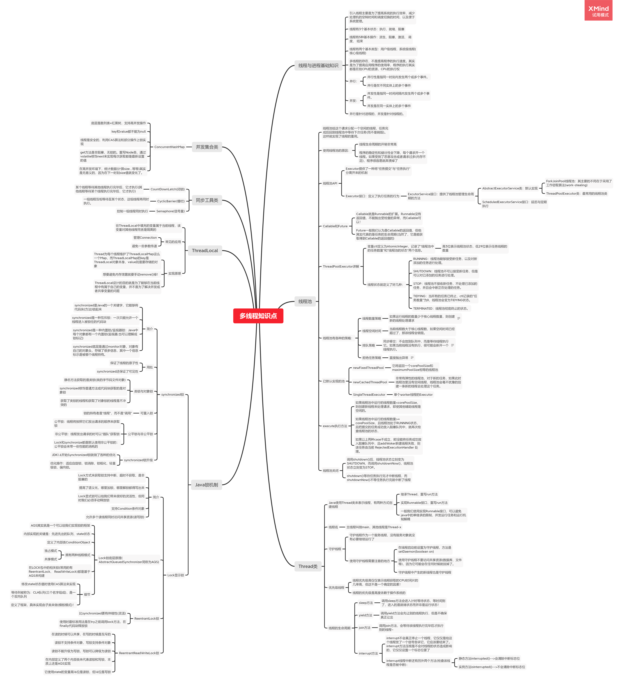

# 作业

## 思考有多少种方式，在 main 函数启动一个新线程，运行一个方法，拿到这个方法的返回值后，退出主线程？写出你的方法，越多越好，提交到 Github。

### 代码仓库

https://github.com/Brikarl/JAVA-000/tree/main/Week_04/homework

## 把多线程和并发相关知识带你梳理一遍，画一个脑图，截图上传到 Github 上。

